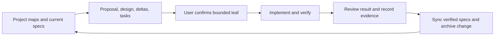

# Contributing

OpenSpec is repository development tooling. It does not become a `yo` tool,
load skills into the running harness, or authorize model filesystem, process,
or network capabilities. `@fission-ai/openspec` is pinned to **1.14.0** as a
local development dependency.

## Setup and commands

```bash
npm ci
npm run openspec -- --version
npm run spec:check
```

Use `npm run openspec -- <arguments>` wherever generated skills show bare
`openspec`. This selects the repository version. Set `OPENSPEC_TELEMETRY=0` to
disable telemetry when desired. Specification validation checks structure; it
does not prove that implementation matches requirements or authorize work.

The committed Codex skills were generated with:

```bash
npm run openspec -- init --tools codex --profile core --no-animation
```

A fresh clone already includes them; after `npm ci`, initialization is unnecessary.
The core profile provides propose, explore, apply-change, update-change,
sync-specs, and archive-change under `.agents/skills/`. Select the relevant skill
in Codex or invoke its name. Keep project instructions in `AGENTS.md` and
`openspec/config.yaml`; do not hand-edit generated skills.

For an intentional version upgrade, update the exact dependency and lockfile,
run `npm run openspec -- update --force`, and review generated changes.
`.prettierignore` excludes generated skills so formatting does not rewrite them.

## Sources of truth

| Location                              | Role                                                                          |
| ------------------------------------- | ----------------------------------------------------------------------------- |
| `CONTRIBUTING.md`                     | Development setup, workflow, and verification                                 |
| `AGENTS.md`                           | Collaboration, bounded confirmation, verification and review rules            |
| `PRD.md`                              | Product boundaries and links to current requirements                          |
| `IMPLEMENTATION_PLAN.md`              | Current state, roadmap order, next candidate, and draft prerequisites         |
| `openspec/specs/`                     | Current implemented behavioral requirements                                   |
| `openspec/changes/<name>/proposal.md` | Motivation, proposed scope, authorization status, and affected capabilities   |
| `openspec/changes/<name>/design.md`   | Component responsibilities, flow, decisions, risks, and verification approach |
| `openspec/changes/<name>/specs/`      | Proposed requirement deltas; not current behavior                             |
| `openspec/changes/<name>/tasks.md`    | Small verifiable implementation steps                                         |
| `openspec/changes/archive/`           | Completed change artifacts and recorded evidence                              |
| `examples/`                           | Repeatable demonstration and captured output                                  |

The current specifications cover [harness](openspec/specs/agent-harness/spec.md),
[chat](openspec/specs/cli-chat/spec.md),
[OAuth/transport](openspec/specs/codex-auth-transport/spec.md),
[patches](openspec/specs/approval-gated-patching/spec.md), and
[observation](openspec/specs/run-observation/spec.md).
Do not keep parallel milestone requirements or active/completed plans in `docs/`.
Legacy SDD configuration, specifications, and evidence have also been removed.

## Working on a change

Read the maps, affected current specifications, and relevant change artifacts.
Follow roadmap prerequisites before selecting the first incomplete task group;
file existence or CLI ready status does not approve a later draft.

Use propose to prepare one bounded change. Explain current and target behavior,
component roles, execution/data flow, relation to pi, risks, checks, and deferred
scope. Confirm the implementation leaf with the user; existing explicit approval
of that same scope remains valid. Implement and verify one step, review the
result, record evidence, and only then complete its task. Never infer human
acceptance from automated validation or agent self-review.

At closure, synchronize only implemented and verified deltas into main specs,
archive the change, and update project maps and links. Preserve current
requirements outside the delta and keep future behavior proposed. Configuration
and prompts guide development; they do not enforce runtime permissions.



## Chat commands and rerun

Start `yo --cwd <workspace>` and enter tasks at `yo>`. The result card and `/runs`
list show the local command hints:

| Command    | Between-turn action                                                      |
| ---------- | ------------------------------------------------------------------------ |
| `/runs`    | List this chat's runs without a model request.                           |
| `/run N`   | Inspect retained evidence for settled run N without executing it.        |
| `/rerun N` | Submit the exact original task of settled run N as a new linked run.     |
| `/exit`    | Exit this chat; this line must be exact, without surrounding whitespace. |

`N` is one positive safe-integer decimal number without a leading zero.
`/runs`, `/run N`, and `/rerun N` accept surrounding whitespace and space/tab
separators; their tokens are lowercase. Missing/invalid numbers, extra arguments,
and unavailable or unsettled selections produce local diagnostics without a new
run, transcript entry, or model request. Lookalikes such as `/RERUN 1` and
`/rerunner` remain ordinary tasks. History and run numbers exist only in this
chat process. Completed, transport-failed, cancelled, and budget-exhausted runs
can be rerun once they settle.

For example, after task 1 and a corrective task 2, `/rerun 1` creates run 3 using
the **current conversation**: both earlier turns and their structured results
appear exactly once, followed by task 1's full original text, including its
whitespace, and only the new attempt's suffix. The command and input identity do
not enter model messages. Run 3 shows `Rerun of #1` and
`Context: current conversation`; rerunning run 3 links the next attempt directly
to 3. Source evidence, outcomes, and frozen timing stay unchanged.

Earlier file observations are historical context. The model is not forced to
reread every file, but every new read uses present workspace bytes. Rerun restores
no file snapshot and replays no old calls or proposals. Previously applied patches
stay applied. A new patch is prepared against current bytes, displays its complete
diff, and needs fresh affirmative consent; prior approval cannot authorize it.
Denial leaves the current bytes unchanged. At a patch approval prompt,
`/rerun N` is consumed as a nonaffirmative response that denies the displayed patch;
it is never queued as a later chat command.

Each attempt receives a fresh ten-request budget, 5,000 ms per-tool execution
timeout, and cancellation controller. Review time is excluded from that timeout.
Ctrl+C requests cancellation during work, and the next chat prompt waits for
settlement and cleanup. Failure or cancellation schedules no automatic retry.

The native reader assigns each arriving line to the latest chat prompt's input
window, including lines buffered during work; startup buffered lines share the
initial window. Equivalent `/rerun N` lines for the same source in one window
share one action receipt. A buffered duplicate dequeued after settlement reports
the existing attempt without another model request or transcript suffix. To make
a deliberate additional attempt, enter the command after a fresh post-settlement
prompt opens. Different selected sources are separate actions, and ordinary tasks
are never deduplicated. Buffered ordinary tasks, inspection, and EOF retain ordered
handling; this rule does not depend on typing speed or timers.

Non-TTY input with arrival identities can rerun tasks, but cannot grant patch
consent: new proposals are denied without reading approval input. A legacy input
adapter lacking arrival identities rejects rerun locally; ordinary tasks and
inspection remain available. These controls follow pi's session-owned submission
and terminal-action separation within yo's sequential, in-memory scope. See the
[rerun design](openspec/changes/archive/2026-10-03-rerun-settled-runs/design.md) and
[verification](openspec/changes/archive/2026-10-03-rerun-settled-runs/verification.md). Integrated
demonstration, real local PTY checks, and final verification are complete.
[Task 6.1](openspec/changes/archive/2026-10-03-rerun-settled-runs/verification.md#task-61-standing-human-approval-and-accepted-scope)
records the received standing human approval and accepted bounded scope. The
verified deltas are synchronized into current specs and rerun is archived;
[task 6.3](openspec/changes/archive/2026-10-03-rerun-settled-runs/verification.md#task-63-archive-and-project-map-closure)
records closure checks and retained coverage limits.

## Current draft and migration boundary

[Allowlisted validation](openspec/changes/allowlisted-validation/proposal.md)
is an imported, unapproved Milestone 5 draft. It has proposal, design, deltas,
and unchecked tasks. Cancellation is complete and recorded in the current specs
and [archive](openspec/changes/archive/2026-10-02-cancel-active-runs/verification.md).
Explicit rerun is implemented, verified, synchronized, and
[archived](openspec/changes/archive/2026-10-03-rerun-settled-runs/verification.md).
The next planning candidate is to rebase and review validation against the
settled cancellation/rerun contracts before proposing a bounded implementation
leaf. The global `npm run spec:check` currently passes all five current specs
and fails only this draft: its CLI-chat modification omits `Rerun after budget
exhaustion` and `Failure without explicit request`. Preserve these current
scenarios during future draft review. The draft remains untouched and unapproved.
Migrating these documents does not authorize
`run_validation`, its proposed permission policy, or any runtime process work.

Already implemented behavior was imported directly into main specs as a baseline,
not as fictional feature changes. The former milestone requirements and plans
were removed after checking their current decisions against the specifications.
The project-state map retains completed cancellation/rerun evidence and the
unapproved validation rebase/review boundary.
The [inspection archive](openspec/changes/archive/2026-10-02-inspect-settled-runs/verification.md)
retains the actual 10.3–10.4 implementation evidence. Historical files remain
recoverable through Git; no duplicate documentation archive is maintained.

## Verification and references

For runtime changes, use focused tests plus applicable repository checks:

```bash
npm run spec:check
npm test
npm run build
npm run format:check
git diff --check
```

Documentation-only changes need structural specification validation, coverage
review, local link checks, formatting, and diff checks. Do not claim fresh runtime,
physical TTY, or live-provider verification from documentation checks.

Run `node examples/run-observation-demo.ts` for a controlled faux scenario
with local inspection, failure, model/approval delays, patch consent, and continued
chat. It uses a temporary fixture, no OAuth or paid request; its
[captured transcript](examples/run-observation-demo.txt) is a demonstration,
not physical TTY evidence.

Run `node examples/run-cancellation-demo.ts` for deterministic cancellation,
held cleanup, exact review cancellation, fresh consent, and frozen retained
inspection. Its [captured transcript](examples/run-cancellation-demo.txt) uses
native readline over controlled streams. For an actual local TTY, run
`node examples/run-cancellation-demo.ts --tty` and follow the printed Ctrl+C
and patch-review recovery steps. Both modes use a temporary fixture and faux
provider without OAuth or network; PTY coverage and remaining physical-keyboard/
live-provider limits are recorded in the
[archived cancellation verification](openspec/changes/archive/2026-10-02-cancel-active-runs/verification.md).

Run `node examples/run-rerun-demo.ts` for an asserted native-readline scenario:
cancel source review, inspect it, correct context and fixture bytes, rerun with
buffered normalized duplicates, and deliberately repeat at fresh prompts.
Command-like approval input denies a new complete diff; only a fresh `yes`
applies it. The [captured transcript](examples/run-rerun-demo.txt) includes
unchanged source inspection and a final assertion marker. The correction writes
only the demonstration's temporary fixture through trusted setup code, not a
model tool. No OAuth, network, or provider configuration is needed.
For a real local terminal, run `node examples/run-rerun-demo.ts --tty` and follow
its exact instructions. A passive demo gate observes Return during run 3 and
leaves that line buffered in the sole native reader; it creates no extra read
owner and removes its listener before settlement. Both modes execute the same
final assertions and remove the fixture on exit. Task 5.1 verifies only controlled
streams; task 5.2 owns actual PTY evidence and coverage limits.

The architecture follows pi's separation of
[session ownership](../pi/packages/coding-agent/src/core/agent-session.ts),
[interactive presentation](../pi/packages/coding-agent/src/modes/interactive/interactive-mode.ts),
and [exact editing](../pi/packages/coding-agent/src/core/tools/edit.ts),
with yo's smaller closed tool registry and explicit patch consent.
For schema and CLI details, use the pinned
[OpenSpec 1.14.0 documentation](https://github.com/Fission-AI/OpenSpec/tree/v1.14.0/docs).
