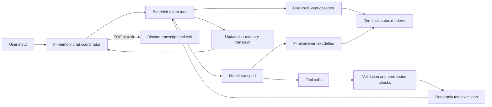

# Implementation plan

Run and review the scoped checks for each leaf item before moving to the next one. Confirm the first incomplete leaf with the user before implementation.

## Completed baseline

Milestone 1, the read-only `yo ask` harness, was completed and verified on 2026-07-24. Its detailed checklist remains available in Git history. The verified baseline includes the bounded agent loop, the closed `list_files` / `search_code` / `read_file` registry, workspace enforcement, structured events and evidence, ChatGPT Plus OAuth, the OpenAI Codex Responses transport, 177 passing tests, a successful build, and one real read-only run without `OPENAI_API_KEY`.

## Milestone 2: in-memory interactive chat

### Goal

Add:

```text
yo chat --cwd <approved-workspace> [--model <name>]
```

The command supports multiple user turns in one process, retains the conversation transcript only in memory, and provides live terminal feedback while the harness waits for the model, executes tools, streams the final answer, and finishes each turn.

Milestone 2 remains a read-only, single-agent harness. It reuses the existing ChatGPT OAuth transport, canonical workspace root, bounded loop, permission checks, structured `RunEvent` values, evidence reporting, and the same three model-visible tools.

### Current behavior

- `yo ask` creates a fresh `SessionState` for one task, runs the bounded loop, and prints the answer and evidence only after the run finishes.
- `runAgent` records lifecycle events in `SessionState.events`, but callers cannot observe those events while the run is active.
- The OpenAI Codex transport can emit final-answer text deltas, but the production CLI does not yet compose that stream with a terminal renderer.
- Every new run starts with a new system and user transcript; there is no in-memory conversation coordinator.
- CLI output has answer and error writers, but no separate status channel or TTY-aware renderer.

### Target behavior

- The CLI canonicalizes `--cwd` once, prompts for user input, and runs repeated bounded turns until EOF or `/exit`.
- One in-memory conversation transcript carries prior user messages, assistant messages, tool calls, and tool results into later turns.
- Each turn has a fresh step budget, its own ordered lifecycle events, final status, stop reason, and evidence.
- Live event delivery lets the terminal show model waiting and tool lifecycle states without changing tool execution or permission decisions.
- Final-answer deltas stream once; the completed answer is not printed a second time.
- Status output uses interactive progress indicators on a TTY and deterministic line-oriented output for non-TTY streams and tests.
- Exiting the process discards the transcript and does not write chat state anywhere.

### Component roles

- **Runtime event recorder:** keeps `SessionState.events` authoritative and optionally publishes immutable event snapshots to an observer as events occur.
- **Bounded agent turn:** performs one user turn with the existing model/tool loop, budgets, closed dispatcher, and exactly one `ToolResult` per requested call.
- **Conversation coordinator:** owns the in-memory transcript, fixed workspace root, selected model, and repeated turn lifecycle. It does not persist or compact state.
- **Terminal status renderer:** converts operational events into safe user-facing statuses. It never performs tools, authorizes actions, or sees credentials.
- **CLI application:** parses `chat`, reads lines through an injectable input boundary, composes the coordinator and renderer, and handles EOF and `/exit`.
- **OpenAI Codex transport:** remains provider-specific and continues to normalize Responses API data. It exposes only final-answer text deltas to the CLI.

### Execution and data flow



### Scope boundaries

#### In scope

- In-memory multi-turn conversation state for one process.
- Live, ordered lifecycle event observation.
- Model-waiting, tool-running, completion, denial, timeout, failure, and turn-finished statuses.
- Safe summaries of known tool arguments, result status, and truncation metadata.
- Streaming final-answer text without duplicate output.
- TTY-aware progress indicators and deterministic non-TTY status lines.
- Injectable input, output, status, and terminal-capability boundaries for deterministic tests.
- Faux-transport tests and one final real ChatGPT Plus chat verification.

#### Deferred

- Persistent sessions, JSONL history, resume, branching, handoff, or cross-process state.
- Context compaction, summarization, retrieval, or an unbounded chat guarantee.
- Full-screen TUI, cursor-addressed panels, history search, or rich keyboard navigation.
- Model-visible write, patch, shell, process, network, credential, or connector tools.
- Validation commands, approvals, skills, extensions, MCP, subagents, API-key fallback, and provider portability.
- New dependencies unless a later approved leaf demonstrates that Node primitives are insufficient.

### Safety and compatibility invariants

- The model-visible registry remains exactly `list_files`, `search_code`, and `read_file`.
- Model-provided tool names and arguments remain untrusted until closed lookup and strict Zod validation.
- Every requested tool call still receives exactly one `ToolResult`.
- The runtime records an event before notifying observers; UI code cannot authorize or execute tools.
- Observer or renderer failure must not corrupt the transcript, duplicate a tool result, or change a permission decision.
- Status output must not expose hidden reasoning, credentials, authorization headers, raw provider payloads, unrestricted tool results, or unsanitized errors.
- Tool summaries use known validated fields, bounded text, and explicit redaction rather than generic object serialization.
- The canonical workspace root and selected model cannot change within a chat process.
- Per-turn step and tool-timeout budgets remain enforced.
- `yo ask`, login, auth status, logout, evidence formatting, and exit-code behavior remain compatible unless an approved leaf explicitly changes them.
- Chat state is never written inside or outside the approved workspace.

### Main risks and mitigations

- **Missing or duplicated live events:** centralize event recording and observation in one helper; test exact order and count against `SessionState.events`.
- **UI failure changes agent semantics:** make event observation non-owning and define failure handling before implementation; preserve runtime state and tool-result invariants.
- **Unsafe status rendering:** format each known event and tool schema explicitly; never dump arbitrary arguments, results, errors, or provider objects.
- **Duplicate final answer:** coordinate text deltas with completed final-answer output and test streamed, non-streamed, empty, and failed responses.
- **Transcript corruption across turns:** keep a single system message, append each user turn once, and verify assistant/tool-call/tool-result ordering with a faux transport.
- **Budget leakage across turns:** create a fresh per-turn budget counter while retaining only the approved conversation transcript.
- **TTY-only behavior breaks tests or pipes:** separate answer, status, and error writers; inject terminal capability and use stable non-TTY lines.
- **Long chats exceed provider context:** do not invent compaction in this milestone; surface a sanitized transport failure and leave compaction to a later milestone.
- **Regression in `yo ask`:** retain its existing fixture and exact-output tests while adding chat-specific composition tests.

## Implementation steps

- [ ] **8.1 Deliver lifecycle events while a run is active**
    - [ ] **8.1.1 Define the live event observer contract**
        - [ ] Add a provider-neutral `RunEvent` observer type and an optional observer field at the bounded-loop boundary.
        - [ ] Specify ordered, exactly-once delivery of immutable event snapshots after the event is recorded in `SessionState.events`.
        - [ ] Define observer-failure behavior so UI failures cannot interrupt tool-result creation, alter permissions, or enter the model transcript.
        - [ ] Keep the observer optional so existing `runAgent` callers retain current behavior.
        - [ ] Verify the contract with focused type and unit tests; do not change CLI output in this leaf.
    - [ ] **8.1.2 Centralize runtime event recording**
        - [ ] Replace direct `session.events.push(...)` calls with one internal record-and-notify helper.
        - [ ] Cover run start/end, model request/response, tool request/authorization/completion, and final-answer events.
        - [ ] Preserve current event order, session state, stop reasons, budgets, and one-result-per-call behavior.
        - [ ] Verify final-answer, tool success, invalid arguments, denial, timeout, execution error, transport failure, and step-budget flows.
    - [ ] **8.1.3 Verify and expose the event boundary**
        - [ ] Export only the minimal public observer contract required by CLI composition.
        - [ ] Verify existing callers without an observer and a controlled observer receiving every event once.
        - [ ] Run focused runtime tests, the full test suite, build, format check, and whitespace check.

- [ ] **8.2 Continue a conversation in memory**
    - [ ] **8.2.1 Define conversation and turn contracts**
        - [ ] Introduce a provider-neutral in-memory conversation state with one system message, fixed workspace root, selected model, and ordered transcript.
        - [ ] Separate conversation-lifetime state from per-turn `SessionState`, events, budgets, final answer, and stop reason.
        - [ ] Define how a completed or failed turn updates the transcript without adding persistence or compaction.
        - [ ] Keep `yo ask` on its existing one-turn contract.
    - [ ] **8.2.2 Implement bounded turn continuation**
        - [ ] Append one user message, run the existing bounded loop against prior messages, and return the updated in-memory conversation plus the turn result.
        - [ ] Preserve assistant tool calls and matching tool results in provider-neutral order for the next model request.
        - [ ] Reset the step counter and per-turn events for each turn while keeping the workspace, model, and transcript fixed.
        - [ ] Stop safely on transport failure or budget exhaustion without inventing a persistent recovery mechanism.
    - [ ] **8.2.3 Verify multi-turn context**
        - [ ] Use a faux transport to verify a first turn with `search_code` and `read_file`, followed by a grounded second-turn answer that relies on prior observations.
        - [ ] Verify the system message appears once, each user message appears once, and tool results remain paired with their calls.
        - [ ] Verify workspace/model immutability, per-turn budget reset, failure behavior, and absence of filesystem writes.
        - [ ] Run focused conversation tests, the full test suite, build, format check, and whitespace check.

- [ ] **8.3 Render safe interactive terminal status**
    - [ ] **8.3.1 Define the renderer boundary**
        - [ ] Add separate injected writers for answers, operational status, and errors.
        - [ ] Add an injected terminal-capability flag rather than reading global TTY state inside pure formatting code.
        - [ ] Map existing events to waiting, running, completed, denied, timeout, failed, and turn-finished states; infer running only after an allow decision.
        - [ ] Keep rendering independent of the provider adapter, dispatcher, and credential store.
    - [ ] **8.3.2 Format safe status summaries**
        - [ ] Format known tool arguments through their strict schemas and bounded field-specific summaries.
        - [ ] Report tool name, safe path/range/filter information, result status, and truncation without printing unrestricted result content.
        - [ ] Sanitize errors and exclude reasoning, credentials, authorization headers, raw provider events, and unknown argument objects.
        - [ ] Use deterministic line-oriented messages for non-TTY output.
    - [ ] **8.3.3 Add TTY progress behavior**
        - [ ] Show and clear a model-waiting indicator between `model_requested` and `model_responded`.
        - [ ] Show and settle tool progress between authorization and completion.
        - [ ] Ensure progress cleanup occurs on success, denial, timeout, error, transport failure, budget exhaustion, and exit.
        - [ ] Prefer Node terminal primitives; do not add a dependency in this leaf without separate approval.
    - [ ] **8.3.4 Verify renderer safety and determinism**
        - [ ] Test every supported event transition in TTY and non-TTY modes with injected writers.
        - [ ] Test malformed/unknown tool arguments, long values, sensitive-looking values, unsanitized errors, and truncated results.
        - [ ] Verify renderer or status-writer failures do not change the agent transcript or tool-result count.
        - [ ] Run focused renderer tests, the full test suite, build, format check, and whitespace check.

- [ ] **8.4 Add the `yo chat` command and input loop**
    - [ ] **8.4.1 Parse the bounded chat command**
        - [ ] Accept exactly `yo chat --cwd <workspace> [--model <name>]`.
        - [ ] Reject missing, duplicate, empty, option-like, unknown, and extra arguments with usage exit code `2`.
        - [ ] Preserve all existing `ask`, login, auth status, and logout parsing behavior.
        - [ ] Canonicalize the workspace once before accepting the first user turn.
    - [ ] **8.4.2 Add an injectable line-input boundary**
        - [ ] Prompt for one line at a time without exposing terminal input as a model tool.
        - [ ] Treat EOF and the exact `/exit` command as clean local termination controls that are not appended to model context.
        - [ ] Define blank-line behavior explicitly and test it without a real terminal.
        - [ ] Close input resources and clear active progress indicators on every exit path.
    - [ ] **8.4.3 Compose the in-memory chat loop**
        - [ ] Reuse one conversation state, workspace root, model, transport, and closed read-only registry across turns.
        - [ ] Run one bounded turn per accepted input line and return to the prompt after a completed turn.
        - [ ] Define whether failed or exhausted turns allow another prompt, then verify that behavior without persistence or automatic retry.
        - [ ] Print per-turn evidence and stop reason without mixing status text into the final-answer channel.
    - [ ] **8.4.4 Verify CLI chat behavior**
        - [ ] Test two-turn success, a tool-using turn, follow-up context, EOF, `/exit`, blank input, transport failure, and step-budget exhaustion with injected input and faux transport.
        - [ ] Verify status ordering, exit codes, cleanup, unchanged workspace contents, and no credential or transcript output.
        - [ ] Verify existing `yo ask` exact output and all authentication commands remain unchanged.
        - [ ] Run focused CLI tests, the full test suite, build, format check, and whitespace check.

- [ ] **8.5 Compose live model streaming with terminal feedback**
    - [ ] **8.5.1 Wire model and tool lifecycle feedback**
        - [ ] Connect the runtime event observer to the terminal renderer for both single-turn and chat composition where approved.
        - [ ] Keep the model-waiting indicator active only while a transport request is in flight.
        - [ ] Transition cleanly from model waiting to tool execution, another model request, final streaming, or failure.
    - [ ] **8.5.2 Stream the final answer exactly once**
        - [ ] Connect the existing OpenAI Codex final-answer delta sink to the answer renderer.
        - [ ] Avoid reprinting the completed answer after deltas have already been emitted.
        - [ ] Fall back to the completed final answer when a transport produces no deltas, including faux transports.
        - [ ] Keep assistant preamble text and hidden reasoning out of the final-answer stream.
    - [ ] **8.5.3 Verify output composition**
        - [ ] Test chunked streaming, no-delta fallback, empty deltas, tool calls before a final answer, malformed streams, authentication failure, usage limits, and transport failure.
        - [ ] Verify TTY progress is cleared before final text and non-TTY output contains no control sequences.
        - [ ] Verify final answer, evidence, status, and error channels contain only their approved content.
        - [ ] Run focused provider/CLI tests, the full test suite, build, format check, and whitespace check.

- [ ] **8.6 Verify Milestone 2**
    - [ ] Run the full faux-transport suite, build, format check, and whitespace check.
    - [ ] Audit every Milestone 2 safety and compatibility invariant against code and executable tests.
    - [ ] Complete one real ChatGPT Plus `yo chat` session without `OPENAI_API_KEY`: one tool-using turn and one follow-up turn.
    - [ ] Confirm live model/tool statuses and final-answer streaming are clear and contain no secrets, hidden reasoning, or duplicate answer text.
    - [ ] Confirm EOF or `/exit` discards the transcript, leaves the approved workspace unchanged, and creates no chat-state file.
    - [ ] Review the final diff and record the next milestone boundary without implementing persistence, compaction, writes, shell, MCP, or subagents.

## Permanent constraints

- No model-visible write, shell, process, network, credential, or connector tools.
- Trusted network access remains limited to ChatGPT OAuth and the OpenAI Codex model transport.
- The only trusted persistent filesystem write remains the OAuth credential store at `~/.yo/auth.json`; no writes are allowed inside the approved workspace.
- No API-key fallback, persistent sessions, JSONL, compaction, TUI, project configuration file, device-code login, multi-provider support, skills, MCP, or subagents in Milestone 2.
- Do not mark a leaf complete until its scoped checks pass and its result is reviewed.
