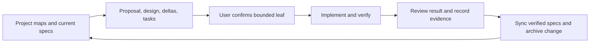

# OpenSpec development workflow

OpenSpec is repository development tooling. It does not become a `yo` tool,
load skills into the running harness, or authorize model filesystem, process,
or network capabilities. `@fission-ai/openspec` is pinned to **1.14.0** as a
local development dependency.

## Setup and commands

```bash
npm ci
npm run openspec -- --version
npm run spec:check
```

Use `npm run openspec -- <arguments>` wherever generated skills show bare
`openspec`. This selects the repository version. Set `OPENSPEC_TELEMETRY=0` to
disable telemetry when desired. Specification validation checks structure; it
does not prove that implementation matches requirements or authorize work.

The committed Codex skills were generated with:

```bash
npm run openspec -- init --tools codex --profile core --no-animation
```

A fresh clone already includes them; after `npm ci`, initialization is unnecessary.
The core profile provides propose, explore, apply-change, update-change,
sync-specs, and archive-change under `.agents/skills/`. Select the relevant skill
in Codex or invoke its name. Keep project instructions in `AGENTS.md` and
`openspec/config.yaml`; do not hand-edit generated skills.

For an intentional version upgrade, update the exact dependency and lockfile,
run `npm run openspec -- update --force`, and review generated changes.
`.prettierignore` excludes generated skills so formatting does not rewrite them.

## Sources of truth

| Location                              | Role                                                                          |
| ------------------------------------- | ----------------------------------------------------------------------------- |
| `AGENTS.md`                           | Collaboration, bounded confirmation, verification and review rules            |
| `PRD.md`                              | Product boundaries and links to current requirements                          |
| `IMPLEMENTATION_PLAN.md`              | Current state, roadmap order, next candidate, and draft prerequisites         |
| `openspec/specs/`                     | Current implemented behavioral requirements                                   |
| `openspec/changes/<name>/proposal.md` | Motivation, proposed scope, authorization status, and affected capabilities   |
| `openspec/changes/<name>/design.md`   | Component responsibilities, flow, decisions, risks, and verification approach |
| `openspec/changes/<name>/specs/`      | Proposed requirement deltas; not current behavior                             |
| `openspec/changes/<name>/tasks.md`    | Small verifiable implementation steps                                         |
| `openspec/changes/archive/`           | Completed change artifacts and recorded evidence                              |
| `docs/examples/`                      | Repeatable demonstration and captured output                                  |

The current specifications cover [harness](../openspec/specs/agent-harness/spec.md),
[chat](../openspec/specs/cli-chat/spec.md),
[OAuth/transport](../openspec/specs/codex-auth-transport/spec.md),
[patches](../openspec/specs/approval-gated-patching/spec.md), and
[observation](../openspec/specs/run-observation/spec.md).
Do not keep parallel milestone requirements or active/completed plans in `docs/`.
Legacy SDD configuration, specifications, and evidence have also been removed.

## Working on a change

Read the maps, affected current specifications, and relevant change artifacts.
Follow roadmap prerequisites before selecting the first incomplete task group;
file existence or CLI ready status does not approve a later draft.

Use propose to prepare one bounded change. Explain current and target behavior,
component roles, execution/data flow, relation to pi, risks, checks, and deferred
scope. Confirm the implementation leaf with the user; existing explicit approval
of that same scope remains valid. Implement and verify one step, review the
result, record evidence, and only then complete its task. Never infer human
acceptance from automated validation or agent self-review.

At closure, synchronize only implemented and verified deltas into main specs,
archive the change, and update project maps and links. Preserve current
requirements outside the delta and keep future behavior proposed. Configuration
and prompts guide development; they do not enforce runtime permissions.



## Current draft and migration boundary

[Allowlisted validation](../openspec/changes/allowlisted-validation/proposal.md)
is an imported, unapproved Milestone 5 draft. It has proposal, design, deltas,
and unchecked tasks. Cancellation and explicit rerun must be separately
implemented and verified first, then its assumptions and deltas must be reviewed
against their settled contracts. Migrating these documents does not authorize
`run_validation`, its proposed permission policy, or any runtime process work.

Already implemented behavior was imported directly into main specs as a baseline,
not as fictional feature changes. The former milestone requirements and plans
were removed after checking their current decisions against the specifications.
Future cancellation/rerun constraints are retained in the project-state map.
The [inspection archive](../openspec/changes/archive/2026-10-02-inspect-settled-runs/verification.md)
retains the actual 10.3–10.4 implementation evidence. Historical files remain
recoverable through Git; no duplicate documentation archive is maintained.

## Verification and references

For runtime changes, use focused tests plus applicable repository checks:

```bash
npm run spec:check
npm test
npm run build
npm run format:check
git diff --check
```

Documentation-only changes need structural specification validation, coverage
review, local link checks, formatting, and diff checks. Do not claim fresh runtime,
physical TTY, or live-provider verification from documentation checks.

Run `node docs/examples/run-observation-demo.ts` for a controlled faux scenario
with local inspection, failure, model/approval delays, patch consent, and continued
chat. It uses a temporary fixture, no OAuth or paid request; its
[captured transcript](examples/run-observation-demo.txt) is a demonstration,
not physical TTY evidence.

The architecture follows pi's separation of
[session ownership](../../pi/packages/coding-agent/src/core/agent-session.ts),
[interactive presentation](../../pi/packages/coding-agent/src/modes/interactive/interactive-mode.ts),
and [exact editing](../../pi/packages/coding-agent/src/core/tools/edit.ts),
with yo's smaller closed tool registry and explicit patch consent.
For schema and CLI details, use the pinned
[OpenSpec 1.14.0 documentation](https://github.com/Fission-AI/OpenSpec/tree/v1.14.0/docs).
