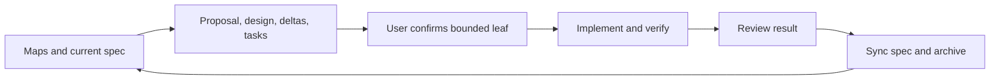

# OpenSpec development workflow

OpenSpec is repository development tooling. It does not become a `yo` tool,
load skills into the running harness, or authorize any process or network action
for the model. The package and lockfile pin `@fission-ai/openspec` to **1.14.0**
as a development dependency; no global installation is required.

## Setup and commands

```bash
npm ci
npm run openspec -- --version
npm run spec:check
```

Use `npm run openspec -- <arguments>` wherever generated skills show a bare
`openspec` command. This always selects the repository version. OpenSpec supports
`OPENSPEC_TELEMETRY=0` to disable its telemetry; set that environment variable for
local or CI invocations when desired. Validation is structural and does not
prove that implementation matches the requirements.

The committed Codex integration was generated with:

```bash
npm run openspec -- init --tools codex --profile core --no-animation
```

A fresh clone already has these skills; initialization is unnecessary after
`npm ci`. The core profile provides propose, explore, apply-change,
update-change, sync-specs, and archive-change skills under `.agents/skills/`.
In Codex CLI/IDE invoke `$openspec-propose`, `$openspec-apply-change`, or the
corresponding skill name. In the desktop app select the skill from Skills;
reload the chat/app if newly added skills have not been discovered.

For an intentional version upgrade, update the exact devDependency and lockfile,
then run `npm run openspec -- update --force` and review generated changes.
Keep project instructions in `AGENTS.md` and `openspec/config.yaml`; do not edit
upstream generated skills. `.prettierignore` excludes only those generated
skill directories so formatting does not rewrite templates.

## Sources of truth

| Location                                                      | Role                                                                            |
| ------------------------------------------------------------- | ------------------------------------------------------------------------------- |
| `AGENTS.md`                                                   | Collaboration, bounded user approval, verification and review rules             |
| `PRD.md`                                                      | Product map, stable boundaries, links to current requirement sources            |
| `IMPLEMENTATION_PLAN.md`                                      | Roadmap, current state, next candidate and active-plan links                    |
| `openspec/specs/run-observation/spec.md`                      | Current requirements for implemented observation leaves 10.1–10.3               |
| `docs/requirements/milestone-4-run-observation.md`            | Historical observation acceptance and deferred later scope                      |
| `openspec/changes/<name>/`                                    | Proposal, design, task list, and requirement deltas for a future bounded change |
| Other `docs/requirements/` and `spec/capabilities/` documents | Existing unmigrated requirement sources; migrate only under separate scope      |
| Completed plans and completed leaf evidence                   | Historical decisions, implementation references, and verification evidence      |

For migrated behavior edit the main specification through a reviewed change;
do not maintain a second editable requirement copy in the old milestone document.
Its historical wording is retained for traceability. Future requirements remain
proposals until their bounded scope is explicitly confirmed and implemented.
The existing SDD Yo patch capability is outside this migration.

## Working on the next change

Read the project maps, current specification, remaining requirements, and active
plan. Propose one bounded change with acceptance criteria and deferred work.
Explain current and target behavior, affected components, execution/data flow,
relation to `pi`, risks, and validation in its design. Obtain confirmation of the
bounded implementation leaf before applying it; existing explicit confirmation
for that exact scope remains valid. A generated task list or ready CLI status
is not human approval.

Implement and verify one small step, review its result, then mark it complete.
Use focused checks followed by applicable project checks. At closure, review
scope and evidence, synchronize only verified requirements, archive the change,
and update map links. Do not record human acceptance unless it occurred.
Project config provides instructions, not an enforcement or permission mechanism.



## First adoption baseline

On 2026-10-02 the user authorized tooling setup and a specification of the already
implemented observation leaves 10.1–10.2. This is a baseline import, not a new
runtime feature, so it is written directly into `openspec/specs/` without a
fictional feature change or archive entry. The historical acceptance and checks
for 10.1–10.2 remain in the active milestone plan. Migration verification and
independent review are reported with this adoption result; authorization to do
this work is not a claim that the user reviewed its final files.

The implementation saves a record, binds its observer, and invokes the turn.
Ordered runtime snapshots update display summaries; only the settled session
finalizes the result. Timing freezes before answer fallback and result output.
The observation layer owns no execution or consent decisions.

| Responsibility                                                                  | Implementation                                                                     | Existing deterministic evidence                                   |
| ------------------------------------------------------------------------------- | ---------------------------------------------------------------------------------- | ----------------------------------------------------------------- |
| Safe projection, call association, settlement, bounded previews and truncation  | `src/run-observation.ts`                                                           | `src/run-observation.test.ts`                                     |
| Record-before-observer-before-turn setup, diagnostics, clocks and isolation     | `src/observation-session.ts`, `src/cli-app.ts`                                     | `src/observation-session.test.ts`, `src/cli-observation.test.ts`  |
| Textual feed/result, call numbers, TTY/non-TTY, answer preservation and consent | `src/terminal-observation.ts`, `src/terminal-renderer.ts`, existing patch approver | `src/terminal-observation.test.ts`, `src/cli-observation.test.ts` |

This follows the relevant `pi` separation between
[`AgentSession.subscribe`](../../pi/packages/coding-agent/src/core/agent-session.ts)
and [interactive event handling](../../pi/packages/coding-agent/src/modes/interactive/interactive-mode.ts).
`yo` retains its smaller same-process scope without persistence, replay, RPC,
extensions, or additional model-visible capabilities.

Run `npm run spec:check`, `npm test`, `npm run build`, `npm run format:check`, and
`git diff --check`. The existing faux demonstration is
`node docs/examples/run-observation-demo.ts`; it does not need OAuth or a paid
model request. Physical TTY and live-provider behavior are not newly verified
by this documentation migration.

At baseline import, leaves 10.3–10.4 were incomplete and unconfirmed.
The subsequent change below implements 10.3, and 10.4 closure is now recorded
in the completed plan. Cancellation, rerun, and model-visible validation still
need separate planning and approval. The developer checks above do not implement the future
`run_validation` capability. No runtime source or test behavior changes are
part of this adoption step.

## Between-turn inspection increment

On 2026-10-02 the user selected `/runs` and `/run N` and explicitly authorized
leaf 10.3. The [change](../openspec/changes/archive/2026-10-02-inspect-settled-runs/proposal.md)
was implemented, checked, self-reviewed, and synchronized into the main
`run-observation` specification: two requirements modified and four added.
The user subsequently authorized 10.4 closure and a final commit. The change
is archived as `2026-10-02-inspect-settled-runs`; Milestone 4 is complete.
Closure evidence is retained in the
[completed plan](plans/completed/milestone-4-run-observation.md). No independent or human implementation review is claimed.

`src/observation-command.ts` parses reserved tokens, `src/cli-app.ts` consumes
them before run creation, and `src/terminal-observation.ts` formats a retained
record without runtime replay or transcript access. The approach follows pi's
local-command/interface boundary with yo's smaller sequential input loop.
See [verification evidence](../openspec/changes/archive/2026-10-02-inspect-settled-runs/verification.md)
and [the captured demo](examples/run-observation-demo.txt). Physical TTY and
live-provider behavior were not newly verified.

## Upstream reference

Use the pinned [OpenSpec 1.14.0 documentation](https://github.com/Fission-AI/OpenSpec/tree/v1.14.0/docs)
for the standard `spec-driven` schema and CLI. This project introduces no custom
schema, global profile, standalone store, or CI deployment.
