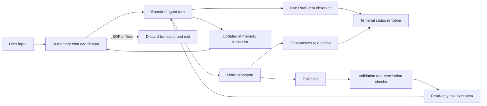

# Active implementation plan: Milestone 2 in-memory interactive chat

- **Status:** active, 8.1–8.3 and 8.4.1 complete
- **First incomplete leaf:** `8.4.2 Add an injectable line-input boundary`
- **Source of truth for:** Milestone 2 implementation order and verification
- **Related documents:** [implementation map](../../../IMPLEMENTATION_PLAN.md),
  [Milestone 2 requirements](../../requirements/milestone-2-in-memory-chat.md)

Run and review the scoped checks for each leaf item before moving to the next
one. Confirm the first incomplete leaf with the user before implementation.

## Goal

Add:

```text
yo chat --cwd <approved-workspace> [--model <name>]
```

The command supports multiple user turns in one process, retains the
conversation transcript only in memory, and provides live terminal feedback
while the harness waits for the model, executes tools, streams the final answer,
and finishes each turn.

Milestone 2 remains a read-only, single-agent harness. It reuses the existing
ChatGPT OAuth transport, canonical workspace root, bounded loop, permission
checks, structured `RunEvent` values, evidence reporting, and the same three
model-visible tools.

## Current behavior

- `yo ask` creates a fresh `SessionState` for one task, runs the bounded loop,
  and prints the answer and evidence only after the run finishes.
- `runAgent` records lifecycle events in `SessionState.events`, but callers
  cannot observe those events while the run is active.
- The OpenAI Codex transport parses text deltas but currently buffers them until
  `response.completed`, then replays them to its final-answer sink; neither the
  transport nor the production CLI displays answer text as network events
  arrive. The `ModelTransport` boundary has no mechanism for a transport to
  deliver streaming deltas to the runtime while a request is in flight.
- Every new run starts with a new system and user transcript; there is no
  in-memory conversation coordinator.
- CLI output has answer and error writers, but no separate status channel or
  TTY-aware renderer.

## Target behavior

- The CLI canonicalizes `--cwd` once, prompts for user input, and runs repeated
  bounded turns until EOF or `/exit`.
- One in-memory conversation transcript carries prior user messages, assistant
  messages, tool calls, and tool results into later turns.
- Each turn has a fresh step budget, its own ordered lifecycle events, final
  status, stop reason, and evidence.
- Live event delivery lets the terminal show model waiting and tool lifecycle
  states without changing tool execution or permission decisions.
- Provider-confirmed final-answer deltas are released through the event
  observer after their output item is complete; the transport invokes the
  per-request `onFinalAnswerDelta` callback only for confirmed final-answer
  output items, assistant commentary and unlabeled text do not enter the answer
  channel, and the evidence summary does not repeat released answer text.
- Whitespace-only input is ignored locally without changing the transcript.
- A transport failure or step-budget exhaustion ends only the current turn,
  reports its sanitized outcome, and returns to the prompt; setup, input, EOF,
  and `/exit` end the process.
- Status output uses interactive progress indicators on a TTY and deterministic
  line-oriented output for non-TTY streams and tests.
- Exiting the process discards the transcript and does not write chat state
  anywhere.

## Component roles

- **Runtime event recorder:** keeps `SessionState.events` authoritative and
  optionally publishes detached, structurally read-only event snapshots to a
  synchronous observer as events occur.
- **Bounded agent turn:** performs one user turn with the existing model/tool
  loop, budgets, closed dispatcher, and exactly one `ToolResult` per requested
  call.
- **Conversation coordinator:** owns the in-memory transcript, fixed workspace
  root, selected model, and repeated turn lifecycle. It does not persist or
  compact state.
- **Terminal status renderer:** converts operational events into safe
  user-facing statuses. It never performs tools, authorizes actions, or sees
  credentials.
- **CLI application:** parses `chat`, reads lines through an injectable input
  boundary, composes the coordinator and renderer, and handles EOF and `/exit`.
- **OpenAI Codex transport:** remains provider-specific, normalizes Responses
  API data, and tracks provider output identity so only provider-labeled
  final-answer deltas reach the runtime through the per-request
  `onFinalAnswerDelta` callback after their output item is complete. Deltas are
  buffered until the output item's identity is confirmed; non-final-answer
  deltas are silently discarded. This is safe delayed release, not byte-by-byte
  terminal streaming.

## Execution and data flow



## Scope boundaries

### In scope

- In-memory multi-turn conversation state for one process.
- Live, ordered lifecycle event observation.
- Model-waiting, tool-running, completion, denial, timeout, failure, and
  turn-finished statuses.
- Safe summaries of known tool arguments, result status, and truncation
  metadata.
- Safe delayed release of provider-labeled final-answer text without
  commentary, unlabeled text, or duplicate output.
- TTY-aware progress indicators and deterministic non-TTY status lines.
- Injectable input, output, status, and terminal-capability boundaries for
  deterministic tests.
- Faux-transport tests and one final real ChatGPT Plus chat verification.

### Deferred

- Persistent sessions, JSONL history, resume, branching, handoff, or
  cross-process state.
- Context compaction, summarization, retrieval, or an unbounded chat guarantee.
- Full-screen TUI, cursor-addressed panels, history search, or rich keyboard
  navigation.
- Model-visible write, patch, shell, process, network, credential, or connector
  tools.
- Validation commands, approvals, skills, extensions, MCP, subagents, API-key
  fallback, and provider portability.
- New dependencies unless a later approved leaf demonstrates that Node
  primitives are insufficient.

## Safety and compatibility invariants

- The model-visible registry remains exactly `list_files`, `search_code`, and
  `read_file`.
- Model-provided tool names and arguments remain untrusted until closed lookup
  and strict Zod validation.
- Every requested tool call still receives exactly one `ToolResult`.
- The runtime records an event before notifying observers; UI code cannot
  authorize or execute tools.
- Observer snapshots share no mutable `ToolCall`, arguments, decision, or
  `ToolResult` objects with the dispatcher, transcript, or authoritative event
  log.
- Observer or renderer failure must not corrupt the transcript, duplicate a
  tool result, or change a permission decision.
- Status output must not expose hidden reasoning, credentials, authorization
  headers, raw provider payloads, unrestricted tool results, or unsanitized
  errors.
- Tool summaries use known validated fields, bounded text, and explicit
  redaction rather than generic object serialization.
- Only provider-labeled final-answer deltas may enter the answer stream;
  commentary, hidden reasoning, unlabeled text, and raw provider events remain
  excluded. Deltas must be buffered until their output identity is confirmed by
  the provider's output-item completion event; transports that cannot
  correlate deltas with confirmed output identity must suppress all delayed
  delta releases and fall back to the completed answer.
- The evidence summary includes stop reason, tools used, and files inspected
  but must not repeat final-answer text that was delivered through the answer
  channel.
- The canonical workspace root and selected model cannot change within a chat
  process.
- Per-turn step and tool-timeout budgets remain enforced.
- `yo ask`, login, auth status, logout, evidence formatting, and exit-code
  behavior remain compatible unless an approved leaf explicitly changes them.
- Chat state is never written inside or outside the approved workspace.

## Main risks and mitigations

- **Missing or duplicated live events:** centralize event recording and
  observation in one helper; test exact order and count against
  `SessionState.events`.
- **UI failure changes agent semantics:** make event observation non-owning and
  define failure handling before implementation; preserve runtime state and
  tool-result invariants.
- **Unsafe status rendering:** format each known event and tool schema
  explicitly; never dump arbitrary arguments, results, errors, or provider
  objects.
- **Misclassified or duplicate final-answer text:** associate deltas with
  provider output identity confirmed by `output_item.done`, buffer until
  confirmed, exclude commentary and unlabeled text, reconcile released text
  with the completed response, print evidence without repeating the answer, and
  test safe delayed release, identity-resolution failure, empty, and failed
  responses.
- **Transcript corruption across turns:** keep a single system message, append
  each user turn once, and verify assistant/tool-call/tool-result ordering with
  a faux transport.
- **Budget leakage across turns:** create a fresh per-turn budget counter while
  retaining only the approved conversation transcript.
- **TTY-only behavior breaks tests or pipes:** separate answer, status, and error
  writers; inject terminal capability and use stable non-TTY lines.
- **Long chats exceed provider context:** do not invent compaction in this
  milestone; surface a sanitized transport failure and leave compaction to a
  later milestone.
- **Regression in `yo ask`:** retain its existing fixture and exact-output tests
  while adding chat-specific composition tests.

## Implementation steps

- [x] **8.1 Deliver lifecycle events while a run is active**
    - [x] **8.1.1 Define the live event observer contract**
        - [x] Add a synchronous provider-neutral `RunEvent` observer type and an
              optional observer field at the bounded-loop boundary.
        - [x] Specify ordered, exactly-once delivery of detached, structurally
              read-only event snapshots after the authoritative event is recorded
              in `SessionState.events`. Include a `final_answer_delta` event
              carrying the released delta string so observers receive answer text
              after the transport confirms its output item.
        - [x] Ensure observer snapshots share no mutable nested call, arguments,
              decision, or result objects with runtime state.
        - [x] Catch observer exceptions at the notification boundary so UI
              failures cannot interrupt tool-result creation, alter permissions, or
              enter the model transcript.
        - [x] Keep the observer optional so existing `runAgent` callers retain
              current behavior.
        - [x] Verify the contract with focused type and unit tests; do not
              change CLI output in this leaf.
    - [x] **8.1.2 Centralize runtime event recording**
        - [x] Replace direct `session.events.push(...)` calls with one internal
              record-and-notify helper.
        - [x] Cover run start/end, model request/response, final-answer delta,
              tool request/authorization/completion, and final-answer events.
        - [x] Preserve current event order, session state, stop reasons,
              budgets, and one-result-per-call behavior.
        - [x] Verify final-answer, tool success, invalid arguments, denial,
              timeout, execution error, transport failure, and step-budget flows.
    - [x] **8.1.3 Verify and expose the event boundary**
        - [x] Export only the minimal public observer contract required by CLI
              composition.
        - [x] Verify existing callers without an observer and a controlled
              observer receiving every event once.
        - [x] Run focused runtime tests, the full test suite, build, format
              check, and whitespace check.

- [ ] **8.2 Continue a conversation in memory**
    - [x] **8.2.1 Define conversation and turn contracts**
        - [x] Introduce a provider-neutral in-memory conversation state with one
              system message, fixed workspace root, selected model, and ordered
              transcript.
        - [x] Separate conversation-lifetime state from per-turn `SessionState`,
              events, budgets, final answer, and stop reason.
        - [x] Define how a completed or failed turn updates the transcript
              without adding persistence or compaction.
        - [x] Keep `yo ask` on its existing one-turn contract.
    - [x] **8.2.2 Implement bounded turn continuation**
        - [x] Append one user message, run the existing bounded loop against
              prior messages, and return the updated in-memory conversation plus the
              turn result.
        - [x] Preserve assistant tool calls and matching tool results in
              provider-neutral order for the next model request.
        - [x] Reset the step counter and per-turn events for each turn while
              keeping the workspace, model, and transcript fixed.
        - [x] Stop safely on transport failure or budget exhaustion without
              inventing a persistent recovery mechanism.
    - [x] **8.2.3 Verify multi-turn context**
        - [x] Use a faux transport to verify a first turn with `search_code` and
              `read_file`, followed by a grounded second-turn answer that relies on
              prior observations.
        - [x] Verify the system message appears once, each user message appears
              once, and tool results remain paired with their calls.
        - [x] Verify workspace/model immutability, per-turn budget reset,
              failure behavior, and absence of filesystem writes.
        - [x] Run focused conversation tests, the full test suite, build, format
              check, and whitespace check.

- [x] **8.3 Render safe interactive terminal status**
    - [x] **8.3.1 Define the renderer boundary**
        - [x] Add separate injected writers for answers, operational status, and
              errors.
        - [x] Add an injected terminal-capability flag rather than reading
              global TTY state inside pure formatting code.
        - [x] Map existing events to waiting, running, completed, denied,
              timeout, failed, and turn-finished states; infer running only after an
              allow decision.
        - [x] Keep rendering independent of the provider adapter, dispatcher,
              and credential store.
    - [x] **8.3.2 Format safe status summaries**
        - [x] Format known tool arguments through their strict schemas and
              bounded field-specific summaries.
        - [x] Report tool name, safe path/range/filter information, result
              status, and truncation without printing unrestricted result content.
        - [x] Sanitize errors and exclude reasoning, credentials, authorization
              headers, raw provider events, and unknown argument objects.
        - [x] Use deterministic line-oriented messages for non-TTY output.
    - [x] **8.3.3 Add TTY progress behavior**
        - [x] Show and clear a model-waiting indicator between `model_requested`
              and `model_responded`.
        - [x] Show and settle tool progress between authorization and
              completion.
        - [x] Ensure progress cleanup occurs on success, denial, timeout, error,
              transport failure, budget exhaustion, and exit.
        - [x] Prefer Node terminal primitives; do not add a dependency in this
              leaf without separate approval.
    - [x] **8.3.4 Verify renderer safety and determinism**
        - [x] Test every supported event transition in TTY and non-TTY modes
              with injected writers.
        - [x] Test malformed/unknown tool arguments, long values,
              sensitive-looking values, unsanitized errors, and truncated results.
        - [x] Verify renderer or status-writer failures do not change the agent
              transcript or tool-result count.
        - [x] Run focused renderer tests, the full test suite, build, format
              check, and whitespace check.

- [ ] **8.4 Add the `yo chat` command and input loop**
    - [x] **8.4.1 Parse the bounded chat command**
        - [x] Extract the command variants, usage text, and pure argument parser
              from `cli-app.ts` into `cli-command.ts` while adding `chat`; keep
              authentication, workspace setup, transport, and runtime
              orchestration outside the parser.
        - [x] Accept exactly
              `yo chat --cwd <workspace> [--model <name>]`.
        - [x] Reject missing, duplicate, empty, option-like, unknown, and extra
              arguments with usage exit code `2`.
        - [x] Preserve all existing `ask`, login, auth status, and logout
              parsing behavior.
        - [x] Canonicalize the workspace once before accepting the first user
              turn.
    - [ ] **8.4.2 Add an injectable line-input boundary**
        - [ ] Prompt for one line at a time without exposing terminal input as a
              model tool.
        - [ ] Treat EOF and the exact `/exit` command as clean local termination
              controls that are not appended to model context.
        - [ ] Ignore whitespace-only input locally, leave the transcript
              unchanged, and prompt again.
        - [ ] Close input resources and clear active progress indicators on
              every exit path.
    - [ ] **8.4.3 Compose the in-memory chat loop**
        - [ ] Extract evidence collection and formatting from `cli-app.ts` into
              `evidence-report.ts`; preserve the exact existing `yo ask` report
              while allowing chat turns to render evidence without repeating
              final-answer text.
        - [ ] Reuse one conversation state, workspace root, model, transport,
              and closed read-only registry across turns.
        - [ ] Run one bounded turn per accepted input line and return to the
              prompt after a completed turn.
        - [ ] After a transport failure or step-budget exhaustion, report the
              sanitized turn outcome and return to the prompt without persistence or
              automatic retry.
        - [ ] End the process only for setup or input failure, EOF, or exact
              `/exit`, with output cleanup on every path.
        - [ ] Print per-turn evidence and stop reason without mixing status text
              into the final-answer channel.
    - [ ] **8.4.4 Verify CLI chat behavior**
        - [ ] Test two-turn success, a tool-using turn, follow-up context, EOF,
              `/exit`, blank input, transport failure, and step-budget exhaustion
              with injected input and faux transport.
        - [ ] Verify status ordering, exit codes, cleanup, unchanged workspace
              contents, and no credential or transcript output.
        - [ ] Verify existing `yo ask` exact output and all authentication
              commands remain unchanged.
        - [ ] Run focused CLI tests, the full test suite, build, format check,
              and whitespace check.

- [ ] **8.5 Compose safe final-answer release with terminal feedback**
    - [ ] **8.5.1 Release safe final-answer deltas after output-item confirmation**
        - [ ] Extend the Codex SSE parser to require and retain the
              `output_index` carried by each `output_text.delta`, then associate
              it with the `response.output_item.done` event carrying the same
              index, which declares the output item's role (message vs reasoning
              vs refusal).
        - [ ] Buffer output-text deltas until the matching output-item completion
              event confirms the item is a final-answer message; silently discard
              deltas whose confirmed item is reasoning, refusal, or unclassified.
        - [ ] Release only confirmed final-answer deltas through the per-request
              `onFinalAnswerDelta` callback once the output item is complete;
              do not promise byte-by-byte rendering while the item is still in
              flight. Never emit commentary, hidden reasoning, unlabeled text,
              or raw provider events through the answer sink.
        - [ ] If output identity cannot be resolved — due to malformed streams,
              missing `output_item.done` events, or ambiguous output ordering —
              suppress all delayed delta releases and fall back to the completed
              `ModelResponse` so the answer still reaches the user without
              leaking unclassified text.
        - [ ] Keep the completed `ModelResponse` authoritative, reconcile
              emitted deltas with its final content, and use complete-answer
              fallback when no safe live deltas were available.
        - [ ] Verify interleaved reasoning and final-answer output items,
              missing `output_item.done` events, misordered output indices,
              stream failure, empty delta sets, and completed-response mismatch
              without real network requests.
    - [ ] **8.5.2 Wire model and tool lifecycle feedback**
        - [ ] Connect the runtime event observer to the terminal renderer for
              both single-turn and chat composition where approved.
        - [ ] Keep the model-waiting indicator active only while a transport
              request is in flight.
        - [ ] Clear model-waiting progress before the first safe final-answer
              delta is written, or on model response, tool execution, or failure
              when no answer delta arrives.
        - [ ] Transition cleanly from model waiting to tool execution, another
              model request, final-answer release, or failure.
    - [ ] **8.5.3 Render the final answer exactly once**
        - [ ] Connect the confirmed final-answer delta sink to the answer
              renderer so received deltas are written without additional
              renderer buffering.
        - [ ] Avoid reprinting the completed answer after deltas have already
              been emitted; track whether any deltas were emitted and suppress
              the completed-answer write when safe release was active.
        - [ ] Fall back to the completed final answer when a transport produces
              no deltas, including faux transports and transports that suppressed
              deltas due to unresolved output identity.
        - [ ] Keep assistant preamble text and hidden reasoning out of the
              final-answer stream.
        - [ ] Ensure the per-turn evidence summary (stop reason, tools, files)
              does not repeat answer text; the answer channel is the sole
              source of answer output.
    - [ ] **8.5.4 Verify output composition**
        - [ ] Test chunked safe release after output-item confirmation,
              commentary exclusion, no-delta fallback, empty deltas, tool calls
              before a final answer, malformed streams, authentication failure,
              usage limits, and transport failure.
        - [ ] Verify TTY progress is cleared before final text and non-TTY
              output contains no control sequences.
        - [ ] Verify final answer, evidence, status, and error channels contain
              only their approved content.
        - [ ] Run focused provider/CLI tests, the full test suite, build, format
              check, and whitespace check.

- [ ] **8.6 Verify Milestone 2**
    - [ ] Run the full faux-transport suite, build, format check, and whitespace
          check.
    - [ ] Audit every Milestone 2 safety and compatibility invariant against
          code and executable tests.
    - [ ] Complete one real ChatGPT Plus `yo chat` session without
          `OPENAI_API_KEY`: one tool-using turn and one follow-up turn.
    - [ ] Confirm live model/tool statuses and final-answer streaming are clear
          and contain no secrets, hidden reasoning, or duplicate answer text.
    - [ ] Confirm EOF or `/exit` discards the transcript, leaves the approved
          workspace unchanged, and creates no chat-state file.
    - [ ] Review the final diff and record the next milestone boundary without
          implementing persistence, compaction, writes, shell, MCP, or subagents.
