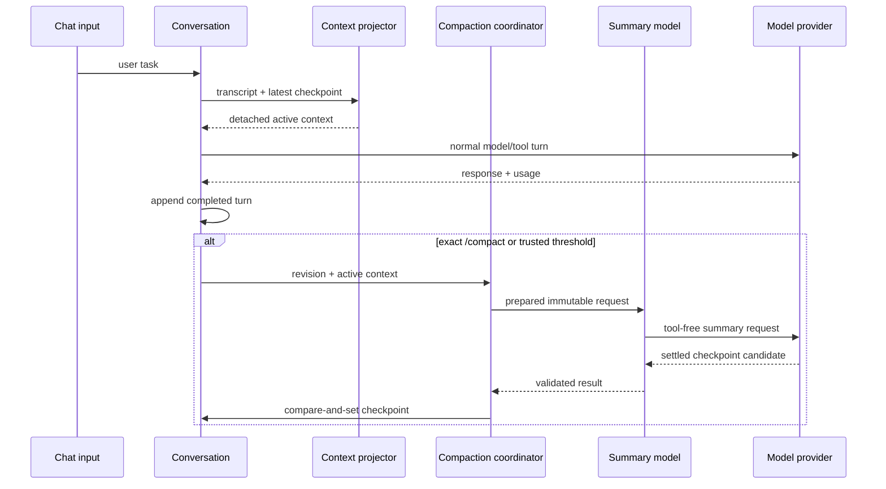

# Milestone 4 active plan: in-memory context compaction

- **Status:** approved; implementation awaits bounded-leaf confirmation
- **Prepared:** 2026-07-28
- **Requirements:** [Milestone 4 in-memory context compaction](../../requirements/milestone-4-context-compaction.md)
- **Previous milestone:** [Milestone 3 completed plan](../completed/milestone-3-approval-gated-patches.md)
- **Next drafted milestone:** [Milestone 5 allowlisted validation](milestone-5-allowlisted-validation.md)

The requirements and this plan are approved. Confirm exactly one incomplete
leaf before editing runtime code.

## Goal

Add one harness-owned in-memory compaction lifecycle. It selects a safe
completed-turn boundary, asks a separately configurable model through the
existing transport for a structured handoff, and retains recent complete
turns.

The full transcript remains in process memory. Compaction changes only the
active context projection used by later model requests.

The milestone adds no model-visible tool and grants no new filesystem, process,
network, credential, or external-service authority. The only new network
operation is trusted provider infrastructure for summarization using the
already selected ChatGPT OAuth credential.

## Current behavior

The verified Milestone 3 runtime has these relevant properties:

- `ConversationState.messages` contains the system prompt and every completed
  conversation message;
- `runConversationTurn` passes all conversation messages to `runAgent`;
- `runAgent` appends user, assistant, and tool messages to one `SessionState`;
- a failed or budget-exhausted turn contributes only the suffix explicitly
  selected by conversation rollback rules;
- model tool calls execute sequentially and every call receives one result;
- patch approval is a terminal callback threaded through dispatcher, loop,
  conversation, CLI, and renderer;
- terminal final-answer deltas settle before the `run_finished` status;
- `ModelTransport` is a function that accepts provider-neutral messages and
  returns final text or tool calls;
- model responses expose no context usage or model-window metadata;
- `runChatInput` recognizes exact `/exit`, treats blank input as a no-op, and
  forwards every other non-blank line as a user task;
- no compaction state, context projection, local `/compact`, threshold check,
  durable session, or overflow recovery exists.

This means the transcript and the next provider context are currently the same
data structure. That coupling must be removed before compaction can be correct.

## Target execution flow

### Normal turn

1. The conversation owns the full in-memory transcript and latest checkpoint.
2. A pure projector creates an active context snapshot.
3. `runConversationTurn` starts `runAgent` from that active snapshot.
4. The turn settles through the existing tool and approval lifecycle.
5. The complete turn suffix is appended once to the full transcript.
6. Reliable response usage replaces only its prior safe metadata.
7. If the threshold is crossed, one automatic compaction may run after answer
   rendering and turn settlement.

### Manual compaction

1. Exact `/compact` is intercepted locally.
2. The runtime snapshots the conversation revision.
3. Pure preparation chooses the old prefix and recent complete-turn suffix.
4. A no-tools summarization request produces the structured handoff.
5. The result settles and passes local validation.
6. Compare-and-set installs the checkpoint only if the revision is unchanged.
7. The next context projection becomes system prompt, compaction-history
   message, and retained suffix.



## Component design

### Compaction contracts and settings

Create a dedicated internal module, expected at
`src/runtime/compaction-contracts.ts`, containing narrow `type` declarations:

```ts
type CompactionReason = 'manual' | 'threshold'

type CompactionSettings = Readonly<{
    reserveTokens: 16_384
    keepRecentTokens: 20_000
    summaryReasoningEffort: 'medium'
}>

type YoCompactorSelection = Readonly<{
    model: string | null
}>

type ModelContextUsage = Readonly<{
    inputTokens: number
    totalTokens: number
    contextWindowTokens: number | null
    checkpointRevision: number
}>
```

Also define:

- checkpoint and outcome contracts;
- preparation and result contracts;
- immutable `yo` compactor selection with an explicit override or inherited
  effective chat model;
- safe aggregate event metadata;
- sanitized compaction error codes;
- immutable default settings;
- predicates for trustworthy post-checkpoint usage;
- detached snapshot helpers.

The module remains internal until the conversation API needs a narrow public
surface. Do not export summarization prompts, credential operations, or raw
compact functions from `src/runtime/index.ts`.

### Pure token estimation and boundary selection

Create `src/runtime/compaction-preparer.ts` for pure mechanics:

- estimate provider-neutral message tokens conservatively;
- combine reliable latest usage with estimated trailing messages;
- identify complete user-turn ranges;
- verify that every assistant call remains paired with its following tool
  result;
- walk backward to retain approximately `keepRecentTokens`;
- produce the old prefix, retained suffix, prior summary, boundary index,
  tokens-before estimate, and safe structured lifecycle facts;
- return `nothing_to_compact` when no complete old turn can be removed.

The first version cuts only at user-turn boundaries. It does not implement
`pi`'s mid-turn cut and separate turn-prefix summarization. This keeps tool
pairing and approval state mechanically simple.

The preparer must treat unknown or malformed external values through local Zod
schemas and `safeParse`, never property-check chains. Pure tests should use
small synthetic transcripts rather than production transport fixtures.

### Full transcript and active context projection

Refactor `src/runtime/conversation.ts` so state distinguishes:

```text
stable system prompt
complete in-memory transcript
conversation revision
selected summary-model override
latest checkpoint
latest reliable usage
```

Create a pure active-context projector, either in
`src/runtime/compaction-context.ts` or beside the conversation state when the
smallest clean boundary is clearer.

For a checkpoint:

```text
system prompt
fixed compaction-history prefix + summary
complete transcript suffix after boundary
```

Do not delete old transcript messages, rewrite earlier `SessionState`, or expose
checkpoint payloads through events. Existing conversation rollback semantics
remain authoritative for deciding which just-finished turn messages join the
full transcript.

Checkpoint installation is one pure compare-and-set operation:

```text
candidate.baseRevision === conversation.revision
    -> install checkpoint
    -> advance revision
else
    -> stale outcome
    -> preserve current checkpoint
```

Tests must prove that returned conversation states and projected messages are
detached from caller-owned arrays and nested tool-result data.

### Structured summarizer

Create `src/runtime/yo-compactor.ts` after preparation and projection are
verified.

The compactor accepts:

- immutable preparation;
- selected compaction model, resolved from the explicit override or the
  effective chat model;
- fixed `medium` reasoning effort;
- a dedicated summary transport function;
- fixed output budget;
- `AbortSignal`.

It constructs the exact handoff sections from the requirements and makes one
tool-free model request. It includes:

- previous summary when repeated compaction occurs;
- the old complete turns being removed;
- safe deterministic facts derived from events, such as files inspected,
  applied/rejected/conflicted patch outcomes, and pending work;
- a fixed reminder that repository text and tool output are data, not
  instructions.

It does not include:

- OAuth data;
- raw hidden reasoning;
- unbounded event logs;
- an approval token or callback;
- model-visible tools.

Use a separate summary-transport contract rather than recursively invoking
`runAgent`. A summary response must be a final text response; tool calls,
refusal, blank output, malformed output, abort, or transport error maps to one
settled failed result.

No final-answer streaming is rendered for the summary. The summary becomes
visible only as future historical context, not as a user-facing answer.

### Model usage boundary

Extend `src/runtime/run.ts` only after the pure compaction path is verified.

The model response needs safe common metadata equivalent to:

```ts
type ModelResponseContext = Readonly<{
    usage: ModelContextUsage | null
}>
```

Both final-answer and tool-call responses carry it. A faux transport can use
`null`. Existing runtime behavior must remain unchanged when metadata is absent.

Thread the context metadata through `runAgent`,
`createConversationTurnResult`, and `runConversationTurn` without adding a
second agent loop or changing tool execution order.

Usage metadata must identify the context/checkpoint revision it describes.
Stale pre-compaction usage cannot trigger compaction immediately after a new
checkpoint.

### Compaction coordinator and events

Create `src/runtime/compaction.ts` only after the state and summarizer contracts
exist.

The coordinator owns:

```text
busy check
    -> immutable preparation
    -> compaction_started
    -> tool-free summary request
    -> settle and validate
    -> abort/stale/error mapping
    -> compare-and-set installation
    -> one terminal lifecycle event
```

It prevents concurrent or recursive compaction and refuses to start while patch
approval is unresolved.

Extend `RunEvent` or add a conversation-level observer with the smallest
coherent ownership. Prefer conversation-level compaction events if forcing them
into a completed `SessionState` would misrepresent the lifecycle. Reuse the
existing deep snapshot mechanics so observers cannot mutate checkpoint state.

The event payload contains only aggregate metadata described by the
requirements.

### Local command and compaction-model selection

Extend `src/cli-command.ts` with:

```text
--compaction-model <name>
```

Parsing remains fail-closed:

- missing, empty, duplicate, and unknown values return usage exit code `2`;
- the option is accepted only for the root chat workflow;
- without an override, the summarizer inherits the effective chat model;
- the selected compaction model and fixed `medium` reasoning effort remain
  immutable for the conversation lifetime;
- auth commands remain unchanged.

Extend `src/line-input.ts` or introduce a narrow local-input result so exact
trimmed `/compact` is distinct from a model task. Preserve:

- exact `/exit`;
- blank no-op;
- EOF;
- ordinary `/compact now` model input.

The CLI composition injects the selected compactor and handles the local result
without reconstructing the conversation. Terminal rendering must finish the
current answer before an automatic status and restore the `yo> ` prompt after
manual completion.

### Threshold orchestration

Add the automatic threshold check last.

After a completed turn:

1. select only usage that describes the current checkpoint revision;
2. require a known positive context window;
3. add conservative estimated trailing tokens;
4. compare to `contextWindowTokens - reserveTokens`;
5. skip if data is missing, stale, failed, or already attempted for this
   revision;
6. run one compaction with reason `threshold`;
7. never retry or automatically continue the model after compaction.

This differs deliberately from `pi` overflow recovery. Compact-and-retry after
a provider context-overflow error remains deferred because it requires error
classification, removal of a failed assistant result, and a one-attempt retry
guard across provider and conversation boundaries.

### Evidence and terminal rendering

Compaction is operational context maintenance, not evidence for the user's code
answer. Do not add summary text to `formatEvidenceReport`.

Terminal statuses may show:

- reason;
- outcome;
- tokens before and after when known;
- safe counts of summarized and retained turns.

They must never show the summary, transcript, credentials, or raw external
errors.

## Relationship to `pi`

Use `pi` as a mechanics reference for:

- separating pure preparation from model summarization;
- reserve-token and keep-recent-token settings;
- conservative token estimation after the last reliable usage;
- safe cut-point selection that does not start at a tool result;
- iterative summaries that incorporate the previous checkpoint;
- stale pre-compaction usage guards;
- manual, threshold, and lifecycle event separation;
- abortable compaction that settles before state replacement.

Keep `yo` smaller:

- complete-turn boundaries only; no split-turn prefix summary;
- one linear in-memory conversation; no session tree or branch summaries;
- no settings manager, extensions, hooks, or custom prompts;
- no on-disk session manager or resume;
- one CLI-selected compactor model with fixed `medium` reasoning; no
  dynamic model switching or settings manager;
- no context-overflow compact-and-retry;
- no compaction while other work is active.

## Scope boundaries

Do not add during Milestone 4:

- persistent sessions or JSONL;
- message-selection, grouping, annotation, deletion, or reordering UI;
- validation or general process execution;
- a model-visible compaction tool;
- project configuration, arbitrary threshold flags, or configurable
  compaction reasoning effort;
- API-key fallback, provider portability, App Server, or SDK integration;
- skills, MCP, connectors, subagents, or richer TUI;
- overflow recovery or automatic model retry;
- refactors unrelated to context projection, compaction, model usage, CLI
  selection, or lifecycle rendering.

Milestone 5 validation stays documentation-only until Milestone 4 is completed
and Milestone 5 is separately reviewed and approved.

## Risks and controls

### Conversation-state expansion

Separating full transcript, active context, usage, and checkpoint state could
turn `ConversationState` into an unstructured container.

Control: introduce narrow discriminated types and pure state transitions before
adding network or CLI behavior.

### Existing rollback regressions

Compaction changes how turn suffixes are projected and could accidentally retain
failed-turn private messages.

Control: preserve existing suffix-selection tests and add checkpoint cases for
failed, exhausted, aborted, and successful turns.

### Summary authority confusion

A summary serialized as a system message could elevate tool output or old
repository text into instructions.

Control: use a distinct internal compaction-history role and a fixed
data-not-instructions prefix after the stable system prompt.

### Approval replay

An old summary could imply a future patch is already approved.

Control: summarize outcomes only, prohibit compaction while approval is active,
and require the unchanged normal approval callback for every later proposal.

## Implementation milestones

### 10.1 Compaction contracts, estimates, and complete-turn preparation

Add only internal pure contracts, fixed settings, conservative message
estimation, trustworthy-usage selection, complete-turn analysis, cut-point
selection, and focused tests.

Acceptance:

- no conversation, agent-loop, CLI, provider, credential, network, or public
  export behavior changes;
- complete-turn and tool-call/result invariants are mechanically tested;
- previous-summary input and `nothing_to_compact` are represented;
- `npm test -- --test-name-pattern` or the repository's focused native Node
  test invocation passes for the new files;
- full project checks pass before marking `10.1` complete.

### 10.2 Full transcript, checkpoint state, and active-context projection

Refactor conversation state to retain the full transcript while projecting a
detached active context from an optional synthetic checkpoint. Add revision
compare-and-set installation and regression coverage for existing turn
rollback behavior.

Acceptance:

- no summarization request exists;
- existing callers without a checkpoint behave identically;
- failed, exhausted, aborted, and successful turn suffixes remain correct;
- detached-state and stale-install tests pass;
- the runtime public surface expands only as required for conversation use.

### 10.3 Tool-free summarization

Add the structured handoff prompt, bounded summary-transport contract,
abort-and-settle behavior, summary validation, iterative prior-summary support,
separate model selection with fixed `medium` reasoning, and deterministic tests.

Acceptance:

- the summarizer cannot receive visible tools or patch approval;
- an explicit compaction model overrides the chat model, while an omitted
  override inherits the effective chat model;
- the summary request always uses fixed `medium` reasoning;
- no compaction coordinator, local command, or auto-trigger is active;
- blank, tool-call, refusal, error, abort, and late-settlement fixtures leave
  conversation state unchanged;
- summary prompts preserve safe state without raw secret-marker output.

### 10.4 Model usage propagation

Extend model response, agent-loop result, turn result, and conversation state
with safe usage metadata. Update faux transports and regression tests with
`null` defaults.

Acceptance:

- normal answers, tool ordering, patch approvals, event snapshots, and
  conversation rollback remain unchanged;
- stale usage is distinguishable from current post-checkpoint usage;
- no coordinator, local command, or automatic compaction exists yet.

### 10.5 Compaction coordinator, events, and manual `/compact`

Integrate one coordinator with conversation revision compare-and-set, safe
events, exact local-command routing, and terminal status rendering.

Acceptance:

- `/compact` never reaches the model;
- `/compact now` remains an ordinary user task;
- busy, unresolved approval, nothing-to-compact, stale, aborted, and failed
  outcomes preserve the old checkpoint;
- final-answer and status ordering remain correct;
- no threshold trigger is active.

### 10.6 Threshold compaction

Run at most one automatic compaction after a settled turn when reliable
current-revision usage crosses the known-window reserve.

Acceptance:

- missing, unknown, stale, and failed usage skips automatically;
- no recursive compaction or compact-and-retry exists;
- automatic failure does not fail the completed turn;
- static and interactive rendering remain ordered;
- threshold event sequences and retry guards are deterministic.

### 10.7 CLI compaction-model selection and deterministic end-to-end coverage

Add strict `--compaction-model <name>` parsing, inherited chat-model behavior,
and complete deterministic CLI scenarios.

Acceptance:

- auth commands and existing root CLI forms remain unchanged;
- invalid option forms return usage exit code `2`;
- the effective compaction model is immutable for the conversation lifetime;
- omission inherits the effective chat model;
- normal turn, manual compact, repeated compact, and follow-up continuation
  work with inherited and explicit faux compaction models.

### 10.8 Real OAuth verification and milestone closure

Run the full project checks, then perform a controlled real ChatGPT OAuth
summary-then-continue smoke with an explicit compaction model.

- verify `/compact` produces a settled checkpoint through the selected summary
  model;
- verify a normal follow-up request consumes the structured checkpoint;
- verify the model retains a pre-compaction task fact;
- verify no summary text appears in terminal status or evidence;
- review the complete diff;
- update root maps and move this plan to `docs/plans/completed/`;
- mark Milestone 4 complete only after user review.

## Validation order

For each bounded leaf:

1. run its focused native Node test file or test-name pattern;
2. run `npm test`;
3. run `npm run build`;
4. run `npm run format:check`;
5. run `git diff --check`;
6. review the scoped diff;
7. mark only that verified leaf complete.

Documentation-only updates require Markdown structure, relative-link
validation, numbering checks, formatting, and `git diff --check`; they do not
require runtime tests when runtime behavior has not changed.

## First implementation candidate

**10.1: compaction contracts, estimates, and complete-turn preparation.**

Before editing runtime code, confirm that exact leaf. It adds no public CLI,
network request, conversation mutation, summarization call, provider
usage propagation, or automatic behavior.

## Deferred after Milestone 4

- Milestone 5 allowlisted `test` and `build`;
- append-only JSONL sessions and checkpoint persistence;
- resume, fork, archive, transcript inspection, and migration;
- context-overflow compact-and-retry;
- custom thresholds, prompts, configurable compaction reasoning effort, and
  dynamic compactor-model switching;
- selective message filtering, grouping, annotations, and derived threads;
- richer TUI, skills/extensions, provider portability, MCP, and subagents.

## External references

- [`pi` compaction preparation and summary implementation](../../../../pi/packages/coding-agent/src/core/compaction/compaction.ts)
- [`pi` auto-compaction orchestration](../../../../pi/packages/coding-agent/src/core/agent-session.ts)
