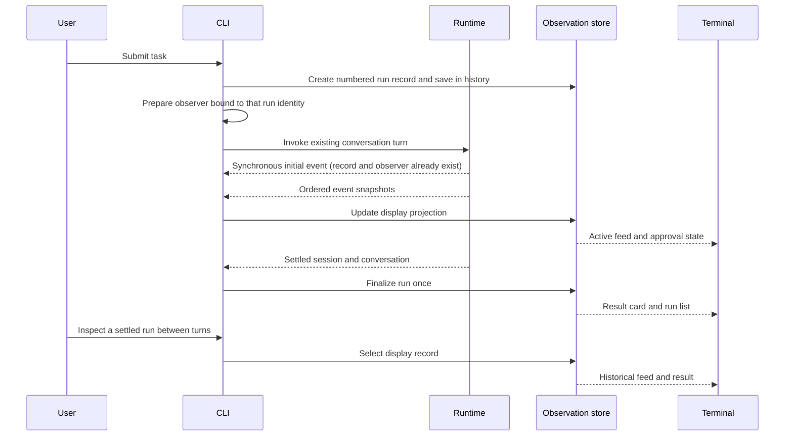

# Milestone 4 active plan: in-memory run observation

- **Status:** leaf 10.1 complete and reviewed; remaining leaves draft
- **Prepared:** 2026-10-01
- **Requirements:** [Milestone 4 run observation](../../requirements/milestone-4-run-observation.md)
- **Previous milestone:** [Milestone 3 completed plan](../completed/milestone-3-approval-gated-patches.md)
- **Later validation milestone:** [Milestone 5 allowlisted validation](milestone-5-allowlisted-validation.md)

On 2026-10-02 the user endorsed the first-version observation direction and
explicitly authorized only leaf 10.1 after its bounded scope was explained.
The user reviewed leaf 10.1 through a diagram and discussion and accepted its
result on 2026-10-02. Leaf 10.1 is complete. Leaves 10.2–10.4 are not authorized by this decision.
Terminal navigation syntax and layout remain undecided. Complete and review
one leaf before confirming the next.

## Plain-language walkthrough

The current agent already emits structured events and returns a settled
`SessionState`. The terminal shows progress and an evidence report, but earlier
run results are not available through an inspection view. Conversation messages
remain the model's history; observation must not change that data flow.

The target first version keeps a lightweight record of each submitted task in
the current CLI session. While a run executes, its event snapshots update a
display projection. When it settles, the projection gets its final status,
answer, and evidence. The user can inspect earlier runs between turns.

The list and result card also show start time and elapsed duration. CLI
composition supplies injectable clocks; the pure projection consumes sampled
values rather than reading time itself. Use wall time for the start label and
monotonic time for elapsed duration, then freeze duration when the run settles.

Keep lifecycle and activity separate: a running run can wait for the model, a
tool, or patch approval, then settle once. Inspection only changes the selected
display record. Controlled faux transports and promise gates make success,
failure, delay, and approval waiting reproducible without a live provider.

There are three responsibilities:

- **CLI composition** numbers runs, connects observers, records settlement,
  samples injected clocks, and routes local inspection without turning it
  into a model request.
- **Observation store** maps ordered events into run summaries, feed rows,
  errors, and approval state without changing runtime state.
- **Terminal presentation** renders the list, selected feed, and result card,
  with keyboard actions and textual statuses, preserving the existing answer
  delivery and exact-patch approval prompt.

The existing agent loop, dispatcher, provider transport, and patch applier
remain authoritative for execution. In `pi`, `AgentSession.subscribe` and the
interactive mode implement the corresponding event/presentation separation.
This plan uses that separation without adopting its broader session machinery.

## Agreed same-process ordering for future leaf 10.2

On 2026-10-02 the user reviewed and agreed this integration invariant. Observation
and execution live in the same process. CLI composition must perform these steps
in order for every task:

1. Create the run record and save it in session observation history.
2. Prepare/connect the event observer bound to that exact run identity.
3. Invoke the existing conversation/agent turn with that observer.

An event emitted synchronously during invocation must already find both its
record and observer. Thereafter project feed updates into that record and
finalize only from the settled session, not merely `run_finished`. No event
buffer, replay, persistence, or network mechanism is required.

Two cases must remain distinct:

- **Missing record:** an integration error. Future leaf 10.2 must expose a safe
  diagnostic through trusted CLI/observation output, without raw event data,
  arguments, credentials, or transport errors. Diagnostic/observer failures
  must remain isolated from agent execution, permissions, consent, and transcript.
- **Already settled record:** an expected late-update guard; leave its result
  unchanged and do not report it as a missing-record error.

Current leaf 10.1 `updateObservedRun` leaves history unchanged when the requested
ID is absent and does not call the updater for settled records. It provides no
missing-record diagnostic. That diagnostic and lifecycle wiring are future
10.2 work, not implemented or authorized by this documentation change.

This adopts `pi` interactive mode's subscription-before-task pattern: its
`rebindCurrentSession` precedes the initial prompt, `AgentSession.subscribe`
registers listeners, and `_emit` calls those listeners directly. Keep only the
in-process ordering boundary; do not adopt broader session infrastructure.

## Scope boundaries and risks

The first version adds no model-visible tool, process capability, network
service, filesystem persistence, or UI dependency. It retains only current
process history and lightweight display summaries. It does not introduce
cancel or rerun controls before their runtime mechanisms exist.

The main risks are duplicate or misattributed events, unsafe error previews,
inspection input interfering with approval, and display failures affecting the
agent. Address them through pure projection checks, safe bounded rendering,
between-turn inspection, and observer isolation. Preserve non-interactive
output and the existing explicit-consent rule.

Clock changes must not affect elapsed duration, and late UI updates must not
reopen settled records. Validate those boundaries with injected clock samples,
duplicate settlement, and interleaved observations from distinct run records.
Repeated tool names or matching event text are not grounds for deduplication.
Network event redelivery/reconnection is outside this in-process interface.

Exact local navigation syntax and layout are a review decision for this plan;
settle them before leaf 10.3. Do not change the public `yo` entrypoint or add a
browser interface as part of that decision.

## Implementation leaves

### 10.1 Session-local run records and pure event projection

- [x] Define narrow `type` contracts for run identity, summaries, feed rows,
      result cards, approval state, and sampled start/elapsed timing.
- [x] Define allowed running/activity/settled transitions; make finalization
      idempotent and reject display updates that reopen a settled record.
- [x] Add a pure projection of existing `RunEventSnapshot` values with ordered
      run/step/call association and one settled result per run.
- [x] Keep answer deltas out of the operational feed; bound display previews
      and avoid duplicating full tool outputs or model transcripts.
- [x] Test multi-call ordering, tool failures, transport failure, budget stop,
      patch waiting/denial/conflict/application, duplicate finalization, late
      updates, and distinct runs with repeated tool names.
- [x] Test start-time samples, monotonic non-negative elapsed time, wall-clock
      changes, and duration freezing without reading real clocks in projection.
- [x] Keep CLI behavior, provider schemas, permissions, and transcript unchanged.

**Leaf acceptance:** pure projection checks pass; no user-facing behavior or
execution authority changes.

**Verified and human-reviewed implementation (2026-10-02):**
[`src/run-observation.ts`](../../../src/run-observation.ts) contains standalone
read-only display contracts, pure event projection, explicit run identity,
activity states, settled-session finalization, sampled timing, and bounded safe
answer/task/file previews. It retains no raw arguments, tool output, transcript,
transport diagnostics, or patch contents. Answer truncation is explicit. The
current CLI and runtime do not import this module.
[`src/run-observation.test.ts`](../../../src/run-observation.test.ts) covers
ordering, failures, patch states, run isolation, late updates, repeated
finalization, timing, safe previews, and file evidence. All 9 focused checks and all 295 project tests passed, along with
`npm run build`, `npm run format:check`, and `git diff --check`. No live OAuth
or model requests were needed.
No navigation, cancellation, rerun, validation process, dependency, or new tool
was added. The user accepted the result after diagram-based review and discussion.

### 10.2 CLI observation lifecycle and safe terminal rendering

- [ ] Create and save each run record, prepare/connect its identity-bound
      observer, then invoke the existing turn, in that mandatory order.
      Compose with the existing terminal observer without changing runtime semantics.
- [ ] Distinguish a missing record from a settled record: report only absence
      as a safe trusted integration diagnostic; retain settled-run late guards.
      Isolate both observer and diagnostic-output failures from execution.
- [ ] Inject wall and monotonic clocks at CLI composition, sample timing for
      display updates, and freeze elapsed duration on settlement.
- [ ] Finalize records from settled sessions; represent unexpected CLI turn
      failure safely without leaving a falsely active record.
- [ ] Render the list, feed, and result card, including timing and available
      actions, from safe projected fields with explicit text labels.
- [ ] Preserve final-answer delivery, evidence, complete patch diff, and
      explicit approval input ownership.
- [ ] Use a synchronously emitting faux runtime to prove record insertion and
      observer preparation precede invocation and the first event finds the
      correct run; verify distinct missing-record and settled-record handling.
- [ ] Test observer/render/diagnostic failure isolation, unchanged permissions
      and transcript, and deterministic non-TTY output.

**Leaf acceptance:** faux turns produce accurate live and settled display
records; rendering failures do not affect execution or consent.

### 10.3 Between-turn inspection and multi-turn verification

- [ ] Implement the reviewed local navigation syntax for the run list and
      selection of a settled run.
- [ ] Keep navigation out of user/model messages and approval responses.
- [ ] Verify multiple turns, previous failed runs, empty history, invalid
      selection, switching between runs without mixed events, and follow-up
      chat after inspection.
- [ ] Verify keyboard-only navigation and approval, and statuses that remain
      understandable with color disabled and in non-TTY output.
- [ ] Reuse faux transports, injected input/clocks, controlled promise gates,
      and temporary workspaces for success, transport/tool error, delay, and
      approval-waiting scenarios; require no real OAuth or paid model calls.
- [ ] Verify session exit discards history and a new process starts empty.
- [ ] Update README usage only for the newly verified behavior and document
      repeatable demo scenarios, architectural choices, and limitations.

**Leaf acceptance:** deterministic CLI flows can inspect earlier runs and then
continue chat with unchanged conversation and patch-approval semantics.

### 10.4 Full verification and first-version closure

- [ ] Run focused checks, `npm test`, `npm run build`,
      `npm run format:check`, and `git diff --check`.
- [ ] Review scope, event order, safe error rendering, and terminal consent.
- [ ] Review the terminal flow using controlled faux transports and temporary
      fixture workspaces for success, failure, delay, and approval waiting;
      record any unverified behavior explicitly.
- [ ] Verify state-transition and timing checks are independent of live
      network timing; keep UI checks distinct from the future model-facing
      repository validation capability.
- [ ] Mark complete only after scoped checks and result review; move the plan
      to `docs/plans/completed/` and update the project maps.

**Leaf acceptance:** the current-session run list, event feed, and result card
are verified and reviewed, with no cancellation, rerun, or validation execution
claimed as implemented.

## Next bounded candidate

Leaf 10.1 is complete. The next candidate is **10.2: CLI observation lifecycle
and safe terminal rendering**; implementation requires separate confirmation.

## Follow-up sequence

After the first version, plan and verify these increments separately:

1. **Cancellation:** define a trusted run controller, propagate abort through
   transport and tools, safely resolve pending approval, wait for settlement,
   and show cancellation requested while waiting for confirmation. Mark
   cancelled only after runtime settlement; if completion won the race, retain
   the completed result. This follows `pi` session abort-and-wait behavior.
   Test cancellation before execution, during a request/tool/approval, repeated
   cancellation, and both completion/cancellation race orders. Cancellation cannot
   undo an already applied patch or fabricate a result for unfinished work.
2. **Explicit rerun:** specify the context snapshot/current-context choice,
   create a new numbered run linked to its source, use current workspace state,
   and require fresh consent for each patch. Retain the previous attempt;
   prevent repeated submission of one pending rerun action from allocating
   duplicate runs, while allowing a deliberate later attempt. Test source
   immutability, changed files, terminal source runs, repeated submission, and
   absence of automatic retry.
3. **Validation results:** implement separately approved Milestone 5 `test`
   and `build`, integrate with the settled cancellation contract, and display
   identifier, outcome, exit code, and bounded diagnostics in the event feed
   and result card. Distinguish failed tests from executor failure and never
   infer success without a confirming tool result.

Cancellation and rerun are roadmap items, not implementation leaves authorized
by approval of the first observation version. Draft and approve their bounded
requirements/plans before coding. Milestone 5 remains a draft until those
preceding increments are verified and its integration assumptions are reviewed.

## Reference project

- [Practical cases: timing, reproducible scenarios, accessibility, and cancellation/rerun rules](https://chatgpt.com/space/page_2a8214f5756481919478bc2b8d020a4a)
- [`pi` session event subscription and run control](../../../../pi/packages/coding-agent/src/core/agent-session.ts)
- [`pi` interactive event handling](../../../../pi/packages/coding-agent/src/modes/interactive/interactive-mode.ts)
- [`yo` runtime event contracts](../../../src/runtime/run.ts)
- [`yo` observer isolation](../../../src/runtime/agent-loop.ts)
