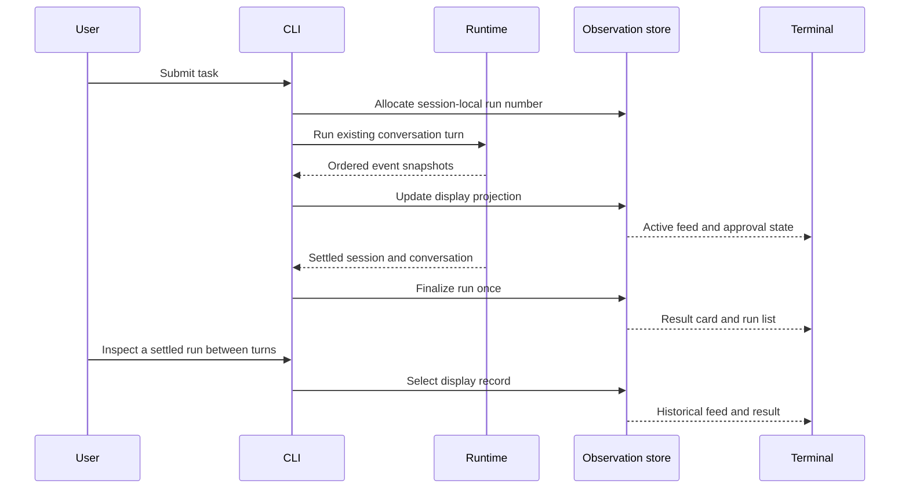

# Milestone 4 active plan: in-memory run observation

- **Status:** draft; implementation not authorized
- **Prepared:** 2026-10-01
- **Requirements:** [Milestone 4 run observation](../../requirements/milestone-4-run-observation.md)
- **Previous milestone:** [Milestone 3 completed plan](../completed/milestone-3-approval-gated-patches.md)
- **Later validation milestone:** [Milestone 5 allowlisted validation](milestone-5-allowlisted-validation.md)

Review the requirements and this plan, then confirm exactly one incomplete leaf
before editing runtime code. Complete and review each leaf before the next.

## Plain-language walkthrough

The current agent already emits structured events and returns a settled
`SessionState`. The terminal shows progress and an evidence report, but earlier
run results are not available through an inspection view. Conversation messages
remain the model's history; observation must not change that data flow.

The target first version keeps a lightweight record of each submitted task in
the current CLI session. While a run executes, its event snapshots update a
display projection. When it settles, the projection gets its final status,
answer, and evidence. The user can inspect earlier runs between turns.

There are three responsibilities:

- **CLI composition** numbers runs, connects observers, records settlement,
  and routes local inspection without turning it into a model request.
- **Observation store** maps ordered events into run summaries, feed rows,
  errors, and approval state without changing runtime state.
- **Terminal presentation** renders the list, selected feed, and result card,
  preserving the existing answer delivery and exact-patch approval prompt.

The existing agent loop, dispatcher, provider transport, and patch applier
remain authoritative for execution. In `pi`, `AgentSession.subscribe` and the
interactive mode implement the corresponding event/presentation separation.
This plan uses that separation without adopting its broader session machinery.

## Scope boundaries and risks

The first version adds no model-visible tool, process capability, network
service, filesystem persistence, or UI dependency. It retains only current
process history and lightweight display summaries. It does not introduce
cancel or rerun controls before their runtime mechanisms exist.

The main risks are duplicate or misattributed events, unsafe error previews,
inspection input interfering with approval, and display failures affecting the
agent. Address them through pure projection checks, safe bounded rendering,
between-turn inspection, and observer isolation. Preserve non-interactive
output and the existing explicit-consent rule.

Exact local navigation syntax and layout are a review decision for this plan;
settle them before leaf 10.3. Do not change the public `yo` entrypoint or add a
browser interface as part of that decision.

## Implementation leaves

### 10.1 Session-local run records and pure event projection

- [ ] Define narrow `type` contracts for run identity, summaries, feed rows,
      result cards, and approval state.
- [ ] Add a pure projection of existing `RunEventSnapshot` values with ordered
      run/step/call association and one settled result per run.
- [ ] Keep answer deltas out of the operational feed; bound display previews
      and avoid duplicating full tool outputs or model transcripts.
- [ ] Test multi-call ordering, tool failures, transport failure, budget stop,
      patch waiting/denial/conflict/application, and finalization.
- [ ] Keep CLI behavior, provider schemas, permissions, and transcript unchanged.

**Leaf acceptance:** pure projection checks pass; no user-facing behavior or
execution authority changes.

### 10.2 CLI observation lifecycle and safe terminal rendering

- [ ] Allocate a record for each user task and compose observation with the
      existing terminal event observer without changing runtime semantics.
- [ ] Finalize records from settled sessions; represent unexpected CLI turn
      failure safely without leaving a falsely active record.
- [ ] Render the list, feed, and result card from safe projected fields.
- [ ] Preserve final-answer delivery, evidence, complete patch diff, and
      explicit approval input ownership.
- [ ] Test observer/render failure isolation and deterministic non-TTY output.

**Leaf acceptance:** faux turns produce accurate live and settled display
records; rendering failures do not affect execution or consent.

### 10.3 Between-turn inspection and multi-turn verification

- [ ] Implement the reviewed local navigation syntax for the run list and
      selection of a settled run.
- [ ] Keep navigation out of user/model messages and approval responses.
- [ ] Verify multiple turns, previous failed runs, empty history, invalid
      selection, and follow-up chat after inspection.
- [ ] Verify session exit discards history and a new process starts empty.
- [ ] Update README usage only for the newly verified behavior.

**Leaf acceptance:** deterministic CLI flows can inspect earlier runs and then
continue chat with unchanged conversation and patch-approval semantics.

### 10.4 Full verification and first-version closure

- [ ] Run focused checks, `npm test`, `npm run build`,
      `npm run format:check`, and `git diff --check`.
- [ ] Review scope, event order, safe error rendering, and terminal consent.
- [ ] Review the terminal flow using controlled faux transports and temporary
      fixture workspaces; record any unverified behavior explicitly.
- [ ] Mark complete only after scoped checks and result review; move the plan
      to `docs/plans/completed/` and update the project maps.

**Leaf acceptance:** the current-session run list, event feed, and result card
are verified and reviewed, with no cancellation, rerun, or validation execution
claimed as implemented.

## First bounded candidate

After requirements/plan review and explicit confirmation, start with **10.1:
session-local run records and pure event projection**. This leaf introduces
display data and transformations only.

## Follow-up sequence

After the first version, plan and verify these increments separately:

1. **Cancellation:** define a trusted run controller, propagate abort through
   transport and tools, safely resolve pending approval, wait for settlement,
   and show cancellation accurately. Test cancellation before execution,
   during a request/tool/approval, and near completion. Cancellation cannot
   undo an already applied patch or fabricate a result for unfinished work.
2. **Explicit rerun:** specify the context snapshot/current-context choice,
   create a new numbered run linked to its source, use current workspace state,
   and require fresh consent for each patch. Test source immutability,
   changed files, terminal source runs, and absence of automatic retry.
3. **Validation results:** implement separately approved Milestone 5 `test`
   and `build`, integrate with the settled cancellation contract, and display
   identifier, outcome, exit code, and bounded diagnostics in the event feed
   and result card. Distinguish failed tests from executor failure and never
   infer success without a confirming tool result.

Cancellation and rerun are roadmap items, not implementation leaves authorized
by approval of the first observation version. Draft and approve their bounded
requirements/plans before coding. Milestone 5 remains a draft until those
preceding increments are verified and its integration assumptions are reviewed.

## Reference project

- [`pi` session event subscription and run control](../../../../pi/packages/coding-agent/src/core/agent-session.ts)
- [`pi` interactive event handling](../../../../pi/packages/coding-agent/src/modes/interactive/interactive-mode.ts)
- [`yo` runtime event contracts](../../../src/runtime/run.ts)
- [`yo` observer isolation](../../../src/runtime/agent-loop.ts)
