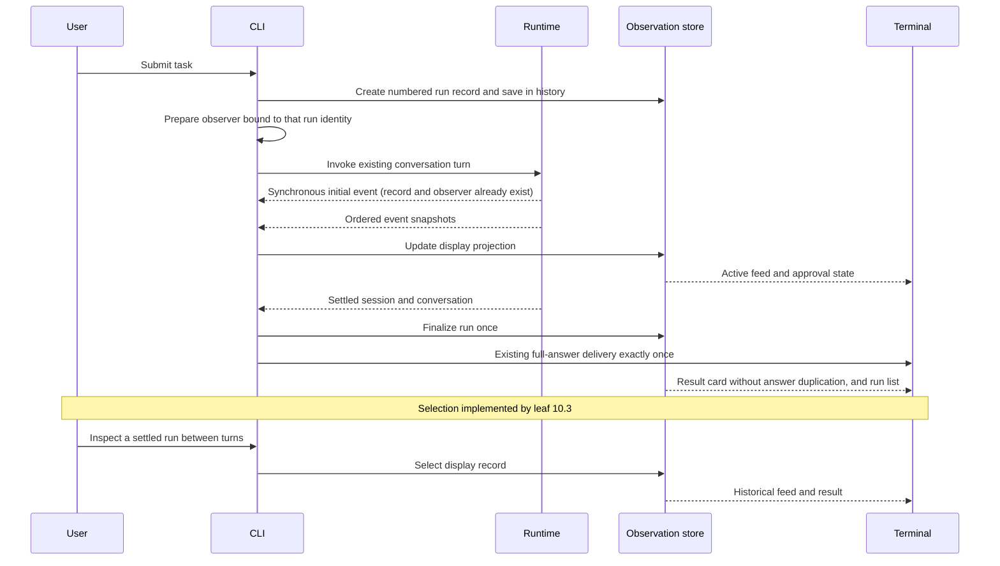

# Milestone 4 completed plan: in-memory run observation

- **Status:** complete through 10.4; verified and reviewed on 2026-10-02
- **Prepared:** 2026-10-01
- **Current 10.1–10.3 requirements:** [OpenSpec baseline](../../../openspec/specs/run-observation/spec.md)
- **Remaining requirements and historical context:** [Milestone 4 run observation](../../requirements/milestone-4-run-observation.md)
- **Previous milestone:** [Milestone 3 completed plan](../completed/milestone-3-approval-gated-patches.md)
- **Later validation milestone:** [Milestone 5 allowlisted validation](../active/milestone-5-allowlisted-validation.md)

On 2026-10-02 the user endorsed the first-version observation direction and
explicitly authorized only leaf 10.1 after its bounded scope was explained.
The user reviewed leaf 10.1 through a diagram and discussion and accepted its
result on 2026-10-02. Leaf 10.1 is complete. That decision did not authorize later leaves.
The user subsequently accepted the 10.2 presentation below and separately,
explicitly authorized continuing its implementation. Leaf 10.2 is complete after verification and independent review, under the user’s instruction to finish and commit it after review. On 2026-10-02 the user selected `/runs` and `/run N` and explicitly authorized
10.3 implementation. It is complete after checks and agent self-review, with
evidence below. The user subsequently authorized 10.4 closure and a final commit; closure evidence is recorded below. Earlier walkthrough and 10.1–10.2
implementation descriptions are historical; the linked OpenSpec specification
owns current behavior. Complete and review one leaf before confirming the next.

## Plain-language walkthrough

The current agent already emits structured events and returns a settled
`SessionState`. The terminal shows progress and an evidence report, but earlier
run results are not available through an inspection view. Conversation messages
remain the model's history; observation must not change that data flow.

The target first version keeps a lightweight record of each submitted task in
the current CLI session. While a run executes, its event snapshots update a
display projection. When it settles, the projection gets its final status,
answer, and evidence. The user can inspect earlier runs between turns.

The list and result card also show start time and elapsed duration. CLI
composition supplies injectable clocks; the pure projection consumes sampled
values rather than reading time itself. Use wall time for the start label and
monotonic time for elapsed duration, then freeze duration when the run settles.

Keep lifecycle and activity separate: a running run can wait for the model, a
tool, or patch approval, then settle once. Inspection only changes the selected
display record. Controlled faux transports and promise gates make success,
failure, delay, and approval waiting reproducible without a live provider.

There are three responsibilities:

- **CLI composition** numbers runs, connects observers, records settlement,
  samples injected clocks, and routes local inspection without turning it
  into a model request.
- **Observation store** maps ordered events into run summaries, feed rows,
  errors, and approval state without changing runtime state.
- **Terminal presentation** renders the list, selected feed, and result card,
  with keyboard actions and textual statuses, preserving the existing answer
  delivery and exact-patch approval prompt.

The existing agent loop, dispatcher, provider transport, and patch applier
remain authoritative for execution. In `pi`, `AgentSession.subscribe` and the
interactive mode implement the corresponding event/presentation separation.
This plan uses that separation without adopting its broader session machinery.

## Agreed same-process ordering in leaf 10.2

On 2026-10-02 the user reviewed and agreed this integration invariant. Observation
and execution live in the same process. CLI composition must perform these steps
in order for every task:

1. Create the run record and save it in session observation history.
2. Prepare/connect the event observer bound to that exact run identity.
3. Invoke the existing conversation/agent turn with that observer.

An event emitted synchronously during invocation must already find both its
record and observer. Thereafter project feed updates into that record and
finalize only from the settled session, not merely `run_finished`. No event
buffer, replay, persistence, or network mechanism is required.

Two cases must remain distinct:

- **Missing record:** an integration error. Leaf 10.2 exposes a safe
  diagnostic through trusted CLI/observation output, without raw event data,
  arguments, credentials, or transport errors. Diagnostic/observer failures
  remain isolated from agent execution, permissions, consent, and transcript.
- **Already settled record:** an expected late-update guard; leave its result
  unchanged and do not report it as a missing-record error.

The pure leaf 10.1 `updateObservedRun` still leaves history unchanged when an ID
is absent and does not call the updater for settled records. Leaf 10.2's
`observation-session.ts` checks the history separately: absence emits a fixed
safe diagnostic; a settled record ignores late callbacks without that diagnostic.
It does not buffer/replay events or alter runtime snapshots. The record is
finalized and its duration frozen before final-answer fallback and result-card
printing; streamed answers retain the existing renderer's delivery path.

This adopts `pi` interactive mode's subscription-before-task pattern: its
`rebindCurrentSession` precedes the initial prompt, `AgentSession.subscribe`
registers listeners, and `_emit` calls those listeners directly. Keep only the
in-process ordering boundary; do not adopt broader session infrastructure.

## Scope boundaries and risks

The first version adds no model-visible tool, process capability, network
service, filesystem persistence, or UI dependency. It retains only current
process history and lightweight display summaries. It does not introduce
cancel or rerun controls before their runtime mechanisms exist.

The main risks are duplicate or misattributed events, unsafe error previews,
inspection input interfering with approval, and display failures affecting the
agent. Address them through pure projection checks, safe bounded rendering,
between-turn inspection, and observer isolation. Preserve non-interactive
output and the existing explicit-consent rule.

Clock changes must not affect elapsed duration, and late UI updates must not
reopen settled records. Validate those boundaries with injected clock samples,
duplicate settlement, and interleaved observations from distinct run records.
Repeated tool names or matching event text are not grounds for deduplication.
Network event redelivery/reconnection is outside this in-process interface.

Exact local navigation syntax and layout are a review decision for this plan;
settle navigation before leaf 10.3. The 10.2 live layout is accepted below. Do not change the public `yo` entrypoint or add a
browser interface as part of that decision.

## Implementation leaves

### 10.1 Session-local run records and pure event projection

- [x] Define narrow `type` contracts for run identity, summaries, feed rows,
      result cards, approval state, and sampled start/elapsed timing.
- [x] Define allowed running/activity/settled transitions; make finalization
      idempotent and reject display updates that reopen a settled record.
- [x] Add a pure projection of existing `RunEventSnapshot` values with ordered
      run/step/call association and one settled result per run.
- [x] Keep answer deltas out of the operational feed; bound display previews
      and avoid duplicating full tool outputs or model transcripts.
- [x] Test multi-call ordering, tool failures, transport failure, budget stop,
      patch waiting/denial/conflict/application, duplicate finalization, late
      updates, and distinct runs with repeated tool names.
- [x] Test start-time samples, monotonic non-negative elapsed time, wall-clock
      changes, and duration freezing without reading real clocks in projection.
- [x] Keep CLI behavior, provider schemas, permissions, and transcript unchanged.

**Leaf acceptance:** pure projection checks pass; no user-facing behavior or
execution authority changes.

**Verified and human-reviewed implementation (2026-10-02):**
[`src/run-observation.ts`](../../../src/run-observation.ts) contains standalone
read-only display contracts, pure event projection, explicit run identity,
activity states, settled-session finalization, sampled timing, and bounded safe
answer/task/file previews. It retains no raw arguments, tool output, transcript,
transport diagnostics, or patch contents. Answer truncation is explicit. At 10.1 completion the CLI and runtime did not import this module;
10.2 now connects it at CLI composition while runtime execution stays independent.
[`src/run-observation.test.ts`](../../../src/run-observation.test.ts) covers
ordering, failures, patch states, run isolation, late updates, repeated
finalization, timing, safe previews, and file evidence. All 9 focused checks and all 295 project tests passed, along with
`npm run build`, `npm run format:check`, and `git diff --check`. No live OAuth
or model requests were needed.
No navigation, cancellation, rerun, validation process, dependency, or new tool
was added. The user accepted the result after diagram-based review and discussion.

### 10.2 CLI observation lifecycle and safe terminal rendering

- [x] Create and save each run record, prepare/connect its identity-bound
      observer, then invoke the existing turn, in that mandatory order.
      Compose with the existing terminal observer without changing runtime semantics.
- [x] Distinguish a missing record from a settled record: report only absence
      as a safe trusted integration diagnostic; retain settled-run late guards.
      Isolate both observer and diagnostic-output failures from execution.
- [x] Inject wall and monotonic clocks at CLI composition, sample timing for
      display updates, and freeze elapsed duration on settlement.
- [x] Finalize records from settled sessions; represent unexpected CLI turn
      failure safely without leaving a falsely active record.
- [x] Render the list, feed, and result card, including timing and available
      actions, from safe projected fields with explicit text labels.
- [x] Preserve final-answer delivery, evidence, complete patch diff, and
      explicit approval input ownership.
- [x] Use a synchronously emitting faux runtime to prove record insertion and
      observer preparation precede invocation and the first event finds the
      correct run; verify distinct missing-record and settled-record handling.
- [x] Test observer/render/diagnostic failure isolation, unchanged permissions
      and transcript, and deterministic non-TTY output.

**Leaf acceptance:** faux turns produce accurate live and settled display
records; rendering failures do not affect execution or consent.

**Accepted presentation and completed implementation (2026-10-02):**

The user accepted a start header with run number, safe task preview, and local
start time; an ordered numbered event feed; and a separate current-activity
line with elapsed time. Interactive terminals replace the activity line;
non-TTY output writes durable text lines. Time updates only on events and
settlement, with no timer. Timing is conservatively labelled `unavailable` if
sampling fails. Existing answer delivery prints the full answer once, then a
compact result card lists status, stop reason, duration, tools/files, fixed
error categories, patch-state trails, and the session's run list. The card
never reprints the bounded answer preview. Keyboard actions remain ordinary
chat submission, exact-patch approval, and `/exit`; there is no navigation yet.

[`src/observation-session.ts`](../../../src/observation-session.ts) owns the
session-local history, identity-bound callbacks, safe diagnostics, and settlement.
[`src/terminal-observation.ts`](../../../src/terminal-observation.ts) renders
only projected fields. [`src/cli-app.ts`](../../../src/cli-app.ts) injects clocks,
saves the record before invoking the existing turn, keeps the existing answer
renderer and exact-diff approver, and replaces legacy operational status output
with this one observation feed. No raw call IDs, arguments, tool contents,
transport diagnostics, or hidden reasoning enter that feed. CLI invocation
failure uses the display-only `cli_turn_error`, never fabricated transport
failure or cancellation. Diagnostic/render/observer failures cannot change
the runtime transcript, permissions, or consent.

Tests cover synchronous first events, missing versus settled records, isolated
projection/observer/render/diagnostic/clock failures, duration freezing before
answer output, full answers beyond preview limits, sequential turns, budget
exhaustion, tool/transport errors, controlled delay, and exact-diff approval
waiting, denial, abort, application, and conflict. Existing CLI evidence and
conversation checks were retained inside assertions for the new result card.
Verification: all 29 focused tests in the three new test files passed;
all 326 project tests passed, including safe truncation metadata and the additional safe-search-evidence
regression. `npm run build`, `npm run format:check`, and `git diff --check`
passed. The repeatable demonstration ran successfully and its captured output
is linked below. No real OAuth or paid model request was used. The user subsequently instructed finishing and committing this step after independent review. Both P2 findings below are closed; no blocking findings remain. This records that instruction and review evidence, not a human line-by-line code review.

**Independent review truncation correction (2026-10-02), re-review confirmed:**
The user authorized the single P2 correction for lost tool-output truncation
warnings. Completion rows now retain a detached truncation flag and locally
validated reason/limit/observed values. Extra metadata fields are allowed at
validation but are not copied into display records. Missing/invalid details
retain a generic `truncated=true` warning; ordinary results remain unchanged.
A real 2001-line `read_file` fixture confirms
`truncated=true reason=line_limit limit=2000 observed=2001`, followed by a
normal read without that warning. Ordered call association, model-visible
results/content, transcript, and source files remain unchanged. Focused tests
also cover all three reasons, absent/invalid details, and safe field retention.
This fixes display evidence only; runtime limits and tool schemas are unchanged.
Physical TTY and real model
calls remain unverified; deterministic terminal/CLI tests and the faux demo
provide the recorded evidence.

**Final review streamed-answer correction (2026-10-02), re-review confirmed:**
Independent review reproduced one-off progress cleanup failure erasing an
already written answer fragment. `clearProgress` now releases its ownership of
the current line before terminal I/O. If line clearing or cursor movement fails,
the existing CLI guard can continue answer delivery without a later retry erasing
that answer. Newly written progress still receives its own normal cleanup.

An injected terminal emulator reproduced visible `WORLD` instead of `HELLO WORLD`
before the fix for both `clearLine` and `moveCursorToStart` failures. After the fix,
both cases retain visible `HELLO WORLD` exactly once, followed by a successful
second task, full patch diff, explicit approval, and applied patch. Assertions
verify visible screen text, preserved assistant messages, exclusive approval
input, and unchanged normal output. All 92 directly relevant CLI/terminal/approval
checks passed, followed by full test/build/format/diff verification. No raw
cleanup error is printed. Independent re-review confirmed both failure cases and found no remaining blockers. Physical TTY remains unverified.

**Repeatable review demonstration:** run
`node docs/examples/run-observation-demo.ts` from the project root. It uses the
real CLI composition with a faux model, injected clocks and input, and one
harmless temporary file; it needs no OAuth, network, paid model request, or
checkout mutation. Only the demonstration merges terminal channels for a
readable transcript. Its captured output is
[`run-observation-demo.txt`](../../examples/run-observation-demo.txt).
Focused checks run with
`node --test src/observation-session.test.ts src/terminal-observation.test.ts src/cli-observation.test.ts`.

### 10.3 Between-turn inspection and multi-turn verification

- [x] Implement the reviewed local navigation syntax for the run list and
      selection of a settled run.
- [x] Keep navigation out of user/model messages and approval responses.
- [x] Verify multiple turns, previous failed runs, empty history, invalid
      selection, switching between runs without mixed events, and follow-up
      chat after inspection.
- [x] Verify keyboard-only navigation and approval, and statuses that remain
      understandable with color disabled and in non-TTY output.
- [x] Reuse faux transports, injected input/clocks, controlled promise gates,
      and temporary workspaces for success, transport/tool error, delay, and
      approval-waiting scenarios; require no real OAuth or paid model calls.
- [x] Verify session exit discards history and a new process starts empty.
- [x] Update README usage only for the newly verified behavior and document
      repeatable demo scenarios, architectural choices, and limitations.

**Leaf acceptance:** deterministic CLI flows can inspect earlier runs and then
continue chat with unchanged conversation and patch-approval semantics.

**Implementation evidence (2026-10-02):**
The [inspect-settled-runs change](../../../openspec/changes/archive/2026-10-02-inspect-settled-runs/proposal.md)
implements the selected commands with no persistent selection or new runtime
capability. The parser and CLI consume inspection before run allocation; pure
formatters read existing safe records and preserve frozen timing. The user
explicitly authorized implementation after selecting command syntax/layout.

All **341 tests** passed, along with build, formatting, strict OpenSpec validation,
and diff checks. Agent self-review and the captured faux demo found no blockers;
[details and limits](../../../openspec/changes/archive/2026-10-02-inspect-settled-runs/verification.md)
record model-request equivalence, failure isolation, input ownership, fresh
consent, and session reset. Physical TTY and live-provider interaction remain
unverified. This is not an independent review or human acceptance claim.
The main OpenSpec specification now owns current 10.3 requirements.

### 10.4 Full verification and first-version closure

- [x] Run focused checks, `npm test`, `npm run build`,
      `npm run format:check`, and `git diff --check`.
- [x] Review scope, event order, safe error rendering, and terminal consent.
- [x] Review the terminal flow using controlled faux transports and temporary
      fixture workspaces for success, failure, delay, and approval waiting;
      record any unverified behavior explicitly.
- [x] Verify state-transition and timing checks are independent of live
      network timing; keep UI checks distinct from the future model-facing
      repository validation capability.
- [x] Mark complete only after scoped checks and result review; move the plan
      to `docs/plans/completed/` and update the project maps.

**Leaf acceptance:** the current-session run list, event feed, and result card
are verified and reviewed, with no cancellation, rerun, or validation execution
claimed as implemented.

**Closure evidence (2026-10-02):**
The user authorized 10.4 and requested committing the result. All **64 focused
checks** and **341 project tests** passed, followed by build, formatting, strict
OpenSpec validation, and diff checks. Re-running the controlled faux demo
produced exactly the saved transcript. The six delta blocks match the main
specification. Closure required documentation/archival changes only.

| Acceptance area                                 | Evidence reviewed                                                                                   |
| ----------------------------------------------- | --------------------------------------------------------------------------------------------------- |
| Ordered multi-turn inspection and frozen timing | CLI control comparisons; injected monotonic clock and wall-clock rollback tests                     |
| Correct run, step, and call association         | Projection tests with repeated calls, isolated runs, and late observers                             |
| One final settlement and immutable history      | Idempotent finalization, running-result rejection, repeated-selection checks                        |
| Accurate failures and budget exhaustion         | Tool-error, transport-error, and budget-exhausted CLI scenarios                                     |
| Exact consent and patch outcomes                | Temporary patch fixtures for waiting, denial, conflict, and application; fresh-consent checks       |
| Observation isolation                           | Unchanged model-request comparisons; projection, rendering, diagnostic, and cleanup fault injection |
| Full repository checks                          | 64 focused tests; 341 total tests; build, format, OpenSpec, and diff checks                         |
| Keyboard and plain-text interaction             | Injected line input, TTY-mode terminal emulator, non-TTY denial and inspection checks               |
| Repeatable terminal flow                        | Faux demo with controlled model/approval gates and exact captured-output comparison                 |

Agent self-review covered the command route before run creation, read-only
formatting, event ordering, safe error categories, frozen clocks, and exclusive
approval input. No blocking findings remain. This records self-review, not an
independent review or a human line-by-line review. Physical TTY and live-provider
interaction were not exercised for closure; injected terminal tests and faux
transport evidence define the verified scope. No OAuth, paid model calls, or
runtime permission expansion was involved.

The OpenSpec change is archived and this plan is retained in `completed`.
Current behavior belongs to the main OpenSpec specification. Cancellation,
rerun, persistence, and model-visible validation remain unimplemented.

## Next planning boundary

Plan **cancellation** separately: a trusted controller that propagates abort
and waits for settlement. Its requirements and first bounded implementation
leaf need user confirmation. The existing Milestone 5 draft is not the next
authorized implementation step.

## Follow-up sequence

After the first version, plan and verify these increments separately:

1. **Cancellation:** define a trusted run controller, propagate abort through
   transport and tools, safely resolve pending approval, wait for settlement,
   and show cancellation requested while waiting for confirmation. Mark
   cancelled only after runtime settlement; if completion won the race, retain
   the completed result. This follows `pi` session abort-and-wait behavior.
   Test cancellation before execution, during a request/tool/approval, repeated
   cancellation, and both completion/cancellation race orders. Cancellation cannot
   undo an already applied patch or fabricate a result for unfinished work.
2. **Explicit rerun:** specify the context snapshot/current-context choice,
   create a new numbered run linked to its source, use current workspace state,
   and require fresh consent for each patch. Retain the previous attempt;
   prevent repeated submission of one pending rerun action from allocating
   duplicate runs, while allowing a deliberate later attempt. Test source
   immutability, changed files, terminal source runs, repeated submission, and
   absence of automatic retry.
3. **Validation results:** implement separately approved Milestone 5 `test`
   and `build`, integrate with the settled cancellation contract, and display
   identifier, outcome, exit code, and bounded diagnostics in the event feed
   and result card. Distinguish failed tests from executor failure and never
   infer success without a confirming tool result.

Cancellation and rerun are roadmap items, not implementation leaves authorized
by approval of the first observation version. Draft and approve their bounded
requirements/plans before coding. Milestone 5 remains a draft until those
preceding increments are verified and its integration assumptions are reviewed.

## Reference project

- [Practical cases: timing, reproducible scenarios, accessibility, and cancellation/rerun rules](https://chatgpt.com/space/page_2a8214f5756481919478bc2b8d020a4a)
- [`pi` session event subscription and run control](../../../../pi/packages/coding-agent/src/core/agent-session.ts)
- [`pi` interactive event handling](../../../../pi/packages/coding-agent/src/modes/interactive/interactive-mode.ts)
- [`yo` runtime event contracts](../../../src/runtime/run.ts)
- [`yo` observer isolation](../../../src/runtime/agent-loop.ts)
