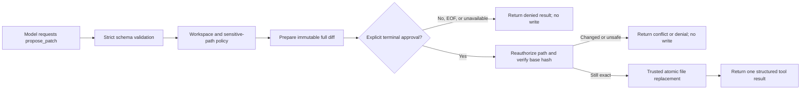

# Milestone 3 requirements: approval-gated patch application

- **Status:** approved
- **Approved:** 2026-07-26
- **Source of truth for:** Milestone 3 scope and acceptance criteria
- **Related documents:** [product map](../../PRD.md),
  [implementation-state map](../../IMPLEMENTATION_PLAN.md),
  [completed plan summary](../plans/completed/milestone-3-approval-gated-patches.md)

Read this document when planning Milestone 3 regressions or compatibility. It
defines the approved product boundary; the completed plan records its verified
implementation and closure.

## Objective

Milestone 3 lets the model propose a precise change to one existing text file
inside the approved workspace. The trusted harness validates the proposal,
shows the user the exact complete diff, and applies it only after explicit
terminal approval.

The model never receives a general write capability. Its proposed action is
untrusted data until application code has validated the schema, authorized the
path, prepared an immutable preview, obtained approval for that exact preview,
and revalidated the file immediately before writing.

This extends `yo` from read-only inspection to one narrow, human-gated local
mutation while preserving the existing provider-neutral agent loop, canonical
workspace boundary, sensitive-path policy, structured results, event
observability, and one-`ToolResult`-per-call invariant.

## Current and target behavior

Today, `yo ask` and `yo chat` expose only `list_files`, `search_code`, and
`read_file`. A model can recommend a change in its answer, but the harness
cannot represent, preview, approve, or apply that change.

After Milestone 3, a patch-capable run may expose a draft-only
`propose_patch` tool. The tool describes exact replacements but does not grant
the model direct filesystem access. Trusted application code owns preparation,
terminal approval, and application:



Human review time is not model execution time. The normal per-tool execution
timeout applies to proposal preparation and application, not to the interval
while the terminal is waiting for the user. EOF, input failure, or process
abort ends the approval wait without applying the patch.

## Model-visible proposal contract

The proposed model-facing contract is:

```ts
type ProposePatchArguments = {
    path: string
    edits: [
        {
            oldText: string
            newText: string
        },
        ...Array<{
            oldText: string
            newText: string
        }>,
    ]
}
```

The arguments remain `unknown` until a strict Zod schema accepts them. Unknown
properties are rejected.

Each proposal:

- targets exactly one existing regular UTF-8 text file;
- contains between 1 and 20 replacements;
- contains no empty `oldText`;
- keeps the combined UTF-8 size of all `oldText` and `newText` values at or
  below 50 KiB;
- matches every `oldText` exactly once in the same original file content;
- matches all replacements against that original content rather than applying
  them incrementally;
- rejects overlapping or nested replacement ranges;
- rejects a proposal whose resulting content is unchanged;
- rejects NUL-containing input or source content rather than treating a binary
  file as text.

Matching is exact after normalizing line endings for comparison. Milestone 3
does not use fuzzy whitespace matching. The applied content preserves the
source file's UTF-8 BOM, dominant line-ending style, and existing permission
mode.

## Immutable proposal and preview

After validation, trusted code prepares an in-memory proposal containing at
least:

```ts
type PatchProposal = {
    id: string
    relativePath: string
    baseHash: string
    nextHash: string
    edits: PatchEdit[]
    nextContent: string
    diff: string
    unifiedPatch: string
}
```

The identifier and base hash bind approval to the precise source bytes and
result shown to the user. Proposal state is not persisted to disk and is
discarded after the call completes or the process exits.

The preview must:

- use the canonical workspace-relative path;
- show the full diff that will be applied, not a summary substituted for it;
- clearly distinguish added and removed lines;
- state that the action writes inside the approved workspace;
- ask a single unambiguous question such as `Apply this patch? [y/N]`;
- remain deterministic and free of terminal control sequences on non-TTY
  output.

Patch inputs and previews are bounded. A source file larger than 1 MiB, a
resulting file larger than 1 MiB, or a unified diff larger than 50 KiB is
rejected. An oversized diff must never be truncated and then offered for
approval because the user would not be reviewing the complete mutation.

Only an explicit case-insensitive `y` or `yes`, followed by a line ending,
approves the displayed proposal. Blank input, any other response, EOF, input
failure, or an unavailable interactive approval channel denies it. Non-TTY
operation may display the proposed diff but must fail closed without applying
it.

## Trusted application boundary

Approval authorizes only the displayed proposal. Immediately before mutation,
trusted application code must:

1. resolve and authorize the path again;
2. reject a symlink in any path component and reject non-regular targets;
3. re-read the current source bytes;
4. compare them with the approved `baseHash`;
5. recompute the replacement result and verify that it produces the approved
   next-content hash and diff.

If any check differs, the result is a conflict and no write occurs. The model
may inspect the new state and submit a new proposal, which requires a new
approval.

Application writes a temporary file in the target directory, preserves the
approved file mode, flushes and closes the temporary file, and atomically
renames it over the target. A failed preparation or write must not expose a
partially written target. Temporary-file cleanup is best effort and must never
broaden the mutation beyond the one approved path.

The base-hash check narrows the time-of-check/time-of-use window but cannot
provide cross-process compare-and-swap semantics on a normal filesystem. The
MVP documents this residual race rather than claiming transactional isolation.

## Permission and agent-loop behavior

Path authorization and human approval are distinct decisions:

- workspace policy determines whether the target is eligible for proposal;
- the user determines whether the exact eligible proposal may be applied.

The harness records safe, structured lifecycle evidence for proposal prepared,
approval requested, approval resolved, application completed, conflict, and
failure. Events and terminal status must not include hidden reasoning,
credentials, raw provider payloads, sensitive file content, or unknown
unvalidated arguments.

Each `propose_patch` call produces exactly one terminal `ToolResult`:

- `success` when the approved patch was applied;
- `denied` when path policy or the user rejects it;
- `invalid_arguments` for a schema or replacement-contract failure;
- `timeout` for bounded preparation or application timeout;
- `execution_error` for a sanitized filesystem failure;
- a machine-readable conflict error when source content changed after preview;
- `aborted` when the run or approval wait is aborted.

The result tells the model whether the patch was applied and provides a safe
next action. A denied, conflicting, timed-out, failed, or aborted call never
writes the target.

`yo chat` retains the structured call and result only in its existing in-memory
conversation. It does not retain a pending approval: the call is resolved
before the agent loop continues. `yo ask` and `yo chat` use the same runtime
contract; when no interactive approval channel is available, both fail closed.

## Relationship to `pi`

Milestone 3 follows useful mechanics from `pi`:

- exact `oldText`/`newText` replacements;
- multiple disjoint edits against one original file version;
- unique-match and overlap validation;
- display-oriented and unified diffs;
- UTF-8 BOM and line-ending preservation;
- serialization of mutations to the same file if concurrent execution is
  introduced later.

`yo` intentionally does not copy `pi`'s broader trust model. `pi`'s built-in
edit tool writes during tool execution and runs with the permissions of the
local process; it has no built-in permission popup or sandbox. Milestone 3
instead separates the model's draft proposal from trusted, exact-preview,
approval-gated application.

It also excludes `pi`'s fuzzy text matching, full-file `write` tool, new-file
creation, shell tool, extension-based permission gates, and TUI-specific live
edit preview.

## Acceptance criteria

- The requirements and active implementation plan are followed, and each
  bounded leaf is approved before its runtime behavior is enabled.
- A model can propose 1–20 exact, non-overlapping replacements for one existing
  regular UTF-8 file inside the canonical approved workspace.
- Unknown properties, empty or duplicate `oldText`, missing matches,
  overlapping ranges, unchanged output, binary content, and proposal,
  file-size, or diff-limit violations are rejected without a write.
- Traversal, absolute-path escape, sensitive paths, symlink paths and targets,
  non-regular files, and paths outside the approved workspace are denied both
  during preparation and immediately before application.
- The terminal displays the complete bounded diff and canonical relative path
  before requesting approval.
- Only explicit `y` or `yes` approval applies the exact displayed proposal.
  Blank input, other input, EOF, input failure, process abort, and unavailable
  interactive approval deny it.
- Approval is bound to an in-memory proposal identifier, source hash,
  next-content hash, and exact diff; the model cannot alter an approved
  proposal.
- A source change between preview and application returns a conflict and leaves
  the newer file untouched.
- Successful application uses an atomic same-directory replacement and
  preserves UTF-8 BOM, line endings, and file mode.
- Every call produces exactly one structured result and ordered, sanitized
  lifecycle evidence; no denial or failure path writes the target.
- Existing `list_files`, `search_code`, `read_file`, per-tool bounds,
  step-budget behavior, final-answer delivery, OAuth commands, and in-memory
  chat behavior remain compatible.
- Deterministic tests cover approval, denial, EOF, non-TTY fail-closed
  behavior, stale-base conflicts, exact matching, overlapping edits, path and
  symlink attacks, limits, atomic-write failures, preservation behavior, event
  order, and one-result-per-call without real credentials or paid requests.
- One manually reviewed ChatGPT Plus run proposes a small patch, displays the
  expected full diff, applies it only after approval, and reports the applied
  path without `OPENAI_API_KEY`.

## Deferred work

Milestone 3 does not add:

- creation, deletion, rename, move, chmod, or arbitrary full-file overwrite;
- multi-file or transactional patch sets;
- automatic test, lint, formatter, build, shell, process, or package-manager
  execution;
- automatic repair after validation failure;
- persistent sessions, pending approvals, JSONL history, compaction, rollback
  history, or crash recovery;
- commit, push, pull request, merge, deployment, or external communication;
- a TUI, external editor, project configuration, skills, extensions, MCP,
  connectors, subagents, background work, or provider portability;
- API-key authentication or any broader credential access;
- a general sandbox or protection against unrelated processes modifying the
  workspace concurrently.

Allowlisted validation commands are a later planning boundary because process
execution has a separate permission, sandboxing, timeout, and output-safety
surface.
