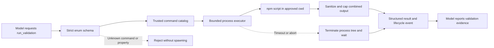

# Milestone 4 requirements: allowlisted validation

- **Status:** draft
- **Prepared:** 2026-07-27
- **Source of truth for:** proposed Milestone 4 scope and acceptance criteria
- **Related documents:** [product map](../../PRD.md),
  [implementation-state map](../../IMPLEMENTATION_PLAN.md),
  [active implementation plan](../plans/active/milestone-4-allowlisted-validation.md)

This document defines the proposed product boundary for Milestone 4. It does
not authorize implementation. After review, approve this document and the
linked plan, then confirm the first bounded leaf before changing runtime code.

## Objective

Milestone 4 lets the model run exactly two repository-defined validation
scripts in the already approved workspace:

- `test`, mapped by trusted harness code to `npm test`;
- `build`, mapped by trusted harness code to `npm run build`.

The model chooses only the validation identifier. It cannot provide a command
string, executable, arguments, working directory, environment, shell, timeout,
or output limit.

This closes the smallest useful coding-agent feedback loop:

```text
inspect -> propose patch -> user approves patch -> validate -> report evidence
```

The harness remains responsible for strict schema validation, the fixed command
catalog, process lifecycle, timeout and cancellation, bounded output,
structured results, operational events, and final evidence.

## Current and target behavior

Today, `yo chat` can inspect an approved workspace and can apply one exact patch
after explicit terminal approval. The model cannot run tests or builds. It must
ask the user to perform validation separately, so it cannot ground its final
answer in executable post-change evidence.

After Milestone 4, the model may request one `run_validation` tool:

```ts
type RunValidationArguments = {
    command: 'test' | 'build'
}
```

The arguments remain `unknown` until a strict Zod schema accepts exactly one
known command and rejects unknown properties.



The allowlist is the runtime permission decision. There is no additional
terminal prompt for each validation call. Selecting `--cwd` authorizes only the
two fixed validation identifiers for that trusted workspace; it does not
authorize any other process command.

## Model-visible contract

The single model-facing tool is named `run_validation`.

Its strict input schema is equivalent to:

```ts
const runValidationArgumentsSchema = z
    .object({
        command: z.enum(['test', 'build']),
    })
    .strict()
```

The tool description must state:

- use `test` to run the repository's test script;
- use `build` to run the repository's build script;
- use validation only when executable evidence is useful;
- a non-zero exit is a validation failure, not proof that the harness failed;
- validation may be requested before a patch to establish a baseline or after
  an applied patch to verify it;
- the tool does not install dependencies or repair failures automatically.

The model cannot add selectors, filenames, flags, workspace names, environment
variables, or extra npm arguments. Missing scripts fail through npm's normal
non-zero exit and produce a structured validation failure.

## Fixed command catalog

Trusted harness code owns an immutable catalog:

| Identifier | Display command | Executable | Fixed argv                                                        |
| ---------- | --------------- | ---------- | ----------------------------------------------------------------- |
| `test`     | `npm test`      | `npm`      | `test --ignore-scripts --offline --audit=false --fund=false`      |
| `build`    | `npm run build` | `npm`      | `run build --ignore-scripts --offline --audit=false --fund=false` |

On Windows the trusted executable name may resolve to `npm.cmd`; this is an
internal platform detail and not model input.

`--ignore-scripts` still runs the explicitly selected `test` or `build` script
but suppresses npm `pre*` and `post*` lifecycle scripts. `--offline`,
`--audit=false`, and `--fund=false` prevent npm itself from initiating registry
work for these validations. They do not sandbox network calls made by the
selected repository script.

The harness passes executable and argv separately with Node child-process
spawning. It never concatenates model data into a shell command. npm itself
uses the platform script shell to interpret the repository's selected
`package.json` script; that script content is trusted workspace code, not
model-provided command text.

## Process execution boundary

Each validation process:

- runs with the canonical approved workspace root as its exact `cwd`;
- receives no stdin;
- uses piped stdout and stderr;
- cannot select a subdirectory;
- uses a fixed 120-second timeout with no model or CLI override in this
  milestone;
- is terminated as a process tree on timeout or run abort;
- is awaited after termination so no known descendant remains intentionally
  detached by the harness;
- produces exactly one settled tool result;
- creates no persistent harness log file.

The executor must not use the existing generic `Promise.race` timeout by
itself. A race can return `timeout` while npm or its script continues running.
Timeout and abort must signal termination, wait for process settlement, drain
or close output streams, and only then return.

The executor may use a short fixed termination grace period before force-kill.
Process-tree termination must have deterministic injected tests and
platform-specific implementation coverage. Background processes deliberately
detached by repository code are outside the guarantee of this unsandboxed
milestone and remain an explicit risk.

## Environment boundary

The child must not inherit the complete parent environment. Trusted harness
code constructs a minimal environment containing only:

- the platform values required to locate and start npm;
- fresh temporary home and cache directories owned by the validation call;
- temporary-directory variables;
- deterministic non-interactive flags such as `CI=1`, `NO_COLOR=1`,
  `FORCE_COLOR=0`, and `TERM=dumb`.

OAuth credentials, authorization headers, API keys, npm tokens, proxy
credentials, and unrelated parent variables are not copied into the child
environment. Temporary home and cache directories are removed after the
process has settled.

This reduces ambient credential exposure but is not a filesystem or network
sandbox. Repository code still executes with the operating-system permissions
of the `yo` process.

## Output and result contract

stdout and stderr are decoded as UTF-8 with replacement for malformed bytes,
combined in observed arrival order, stripped of ANSI terminal controls, and
normalized so process output cannot inject terminal control sequences into the
model transcript or status renderer.

Combined output is bounded to:

- at most 2,000 logical lines;
- at most 50 KiB of UTF-8 text.

When either limit is exceeded, the result keeps the most recent complete
diagnostic tail that fits, marks metadata as truncated, and reports the
limiting reason, limit, and observed count. The executor must keep bounded
memory while the process is running; it must not collect unbounded output and
truncate only afterward.

Every result begins with a deterministic summary containing:

- validation identifier;
- fixed display command;
- outcome;
- exit code when available;
- whether output was truncated.

Validation metadata extends the existing tool-result metadata with safe
structured fields:

```ts
type ValidationResultMetadata = {
    command: 'test' | 'build'
    displayCommand: 'npm test' | 'npm run build'
    outcome: 'passed' | 'failed' | 'timeout' | 'aborted' | 'execution_error'
    exitCode: number | null
}
```

Result mapping:

- exit code `0` -> `success`, outcome `passed`;
- non-zero exit -> `execution_error`, error code `validation_failed`, outcome
  `failed`, with bounded diagnostic output;
- timeout -> `timeout`, error code `validation_timeout`, outcome `timeout`, with
  bounded partial output;
- run abort -> `aborted`, error code `validation_aborted`, outcome `aborted`;
- spawn, stream, or cleanup failure -> `execution_error`, sanitized error code
  `validation_execution_error`, without raw environment or unsafe external
  error fields.

An expected test assertion or TypeScript compilation failure is therefore
distinguishable from inability to start or control the validation process.

## Agent-loop and observability behavior

`run_validation` participates in the existing provider-neutral loop:

1. record `tool_requested`;
2. validate the strict schema;
3. record the allow or denial decision;
4. execute the selected fixed validation;
5. record exactly one `tool_completed`;
6. append exactly one structured tool result to the transcript;
7. continue within the existing model-step budget.

No hidden reasoning is recorded. Events and evidence may include the validation
identifier, fixed display command, outcome, exit code, and truncation metadata.
They must not include parent environment variables, temporary paths, raw spawn
options, OAuth data, or unsanitized process errors.

The terminal renderer shows bounded status such as:

```text
status: tool_running step=3 tool=run_validation command="test"
status: tool_completed step=3 tool=run_validation command="test"
```

Failed, timed-out, and aborted validations use the existing failure status
vocabulary. Command output is returned through the tool result for the model;
the status line remains one-line, deterministic, and secret-conscious.

The evidence report adds a `Validations:` section, for example:

```text
Validations:
- test: passed
- build: failed (exit 2)
```

The final answer must not claim a validation passed unless the corresponding
tool result confirms exit code `0`. A failed or unavailable validation remains
evidence and must be reported accurately.

## Scope

### In scope

- One model-facing `run_validation` tool.
- Exactly two strict identifiers: `test` and `build`.
- Fixed npm executable and argv mapping owned by trusted harness code.
- Canonical workspace root as fixed `cwd`.
- No stdin and no model-controlled environment or arguments.
- Minimal child environment with temporary home and npm cache.
- Fixed timeout, abort handling, process-tree termination, and settle-before-
  return behavior.
- Bounded sanitized combined stdout/stderr with truncation metadata.
- Structured pass, failure, timeout, abort, and execution-error outcomes.
- Existing agent-loop, conversation, terminal status, provider schema, system
  prompt, and evidence integration.
- Deterministic tests using injected process operations and temporary explicit
  workspaces.
- One real local fixture verification and one manually reviewed ChatGPT
  Plus-backed `yo` flow after all automated checks.

### Deferred

- Arbitrary shell or command strings.
- Additional validation identifiers, including lint, typecheck, format,
  coverage, benchmarks, or user-defined scripts.
- Model-provided arguments, test selectors, paths, workspaces, environment
  variables, timeouts, or output limits.
- Package-manager detection or support for pnpm, yarn, bun, cargo, pytest,
  gradle, make, or other runners.
- Dependency installation, update, audit, rebuild, or package download.
- npm workspaces, subpackage selection, or validation from a subdirectory.
- Streaming command output to the interactive terminal.
- Persistent full command logs or external output artifacts.
- Automatic validation after every patch.
- Automatic repair, retry, rollback, or test/build dependency ordering.
- New terminal approval prompts or approval caching for validation.
- Filesystem, process, CPU, memory, or network sandboxing.
- Containers, virtual machines, remote executors, CI integration, or
  background jobs.
- Persistent sessions, JSONL, compaction, TUI, skills, extensions, MCP,
  connectors, subagents, provider portability, git operations, deployment, or
  external communication.

## Trust and safety assumptions

This milestone deliberately trusts the selected repository's `test` and
`build` script bodies. The allowlist prevents the model from choosing another
command, but it cannot make those two scripts intrinsically safe.

The scripts may:

- read or modify workspace files;
- create build artifacts;
- execute local dependencies from `node_modules/.bin`;
- spawn descendants;
- use the network directly;
- access files that the operating-system user can access.

The minimal environment prevents passive inheritance of common credentials,
and npm is run offline with lifecycle hooks disabled, but no unsandboxed
process can provide a strict filesystem or network isolation guarantee.

Therefore:

- users must run Milestone 4 only against workspaces whose validation scripts
  they trust;
- documentation and terminal help must not describe the feature as sandboxed;
- `run_validation` is process execution even though it exposes no general
  shell;
- future use with untrusted repositories requires a separately approved
  sandbox milestone.

## Compatibility and safety invariants

- Existing `list_files`, `search_code`, `read_file`, and `propose_patch`
  behavior remains unchanged.
- `ToolCall.name` remains a string and `arguments` remain `unknown` until
  strict local validation.
- Unknown validation commands and properties fail before any process starts.
- Only the trusted catalog selects executable, argv, cwd, environment, timeout,
  and limits.
- No model-provided string is evaluated as shell syntax.
- npm lifecycle hooks other than the explicitly selected script are disabled.
- npm itself is configured offline for the validation call.
- The child receives no terminal stdin and no OAuth or ambient secret
  environment.
- Timeout and abort do not return before harness-owned process termination has
  settled.
- Output buffering remains bounded throughout execution.
- Every validation request produces exactly one result and one terminal
  `tool_completed` event.
- A non-zero validation exit is never reported as passed.
- A passed command is evidence for only the selected identifier; passing
  `test` does not imply `build` passed, and vice versa.
- Patch approval and validation authorization remain distinct. Applying a
  patch does not automatically run validation, and validation cannot approve
  or apply a patch.
- Existing OAuth, model transport, step budget, conversation, final-answer,
  renderer-failure isolation, and evidence behavior remains compatible.
- Tests never run repository-defined scripts in the user's checkout; real
  process tests use controlled temporary fixtures.

## Main risks and mitigations

### Allowlist looks safer than repository scripts are

**Risk:** users infer that `test` and `build` are harmless because the model
cannot select other commands.

**Mitigation:** name process execution explicitly, document the trusted-
workspace assumption, strip ambient credentials, run npm offline with
lifecycle hooks disabled, and defer untrusted repositories until sandboxing is
designed.

### Timeout returns while work continues

**Risk:** npm or a descendant survives after the tool has returned `timeout`.

**Mitigation:** use abort-and-settle process control, terminate the process
tree, wait for settlement, and test late exit, ignored graceful termination,
and cleanup paths. Do not wrap the executor only in the generic
`Promise.race`.

### Output exhausts memory or controls the terminal

**Risk:** noisy or malicious scripts emit unbounded bytes, binary data, or ANSI
controls.

**Mitigation:** incremental decoding, ANSI/control sanitization, bounded
headless tail accumulation, explicit truncation metadata, ignored stdin, and
no direct live output streaming.

### Child inherits secrets

**Risk:** test code reads OAuth tokens, npm credentials, cloud keys, or proxy
authorization from the parent environment.

**Mitigation:** construct a minimal environment, use temporary home and cache
directories, omit credential and proxy variables, and keep raw spawn state out
of events and errors. Full filesystem isolation remains deferred and is not
claimed.

### Provider exposes the capability before enforcement exists

**Risk:** the model sees `run_validation` while dispatcher denial, cancellation,
or output bounds are incomplete.

**Mitigation:** implement contracts and executor first, integrate and test the
closed dispatcher next, and activate `ToolName`, visible-tools, provider schema,
and prompt only in a later leaf.

### Validation changes the workspace

**Risk:** repository scripts generate or modify files after an approved patch.

**Mitigation:** state that scripts are trusted code with OS permissions, record
the validation outcome without claiming workspace immutability, and defer
turn-scoped diff accounting or rollback to a later milestone.

## Acceptance criteria

Milestone 4 is complete only when:

1. The only accepted arguments are `{ command: 'test' }` and
   `{ command: 'build' }`.
2. The fixed catalog selects the exact npm invocations and disables other npm
   lifecycle hooks.
3. Invalid or unknown arguments start no process and return one structured
   failure.
4. Each command runs only at the canonical approved workspace root, with no
   stdin or model-controlled spawn option.
5. The child receives a documented minimal environment and no inherited OAuth,
   API-key, npm-token, or proxy credential variable.
6. Exit `0`, non-zero exit, spawn failure, timeout, abort, and output
   truncation produce deterministic structured results.
7. Timeout and abort terminate and settle the harness-owned process tree before
   returning.
8. Combined output is sanitized, incrementally bounded to 2,000 lines and
   50 KiB, and reports accurate truncation metadata.
9. Agent-loop events, transcript results, terminal statuses, and evidence each
   represent a validation call exactly once without unsafe environment or
   error data.
10. The provider exposes only the strict `run_validation` enum schema after all
    runtime enforcement exists.
11. `yo chat` can use both validations through deterministic faux transports.
12. Existing read, patch, approval, OAuth, chat, renderer, and final-answer
    tests remain green.
13. Focused tests, `npm test`, `npm run build`, `npm run format:check`, and
    `git diff --check` pass.
14. A controlled real-process fixture confirms both `test` and `build`
    mappings without network or real credentials.
15. A manually reviewed ChatGPT Plus-backed flow confirms that the model can
    apply an approved patch, run an appropriate validation, and accurately
    report its outcome.
