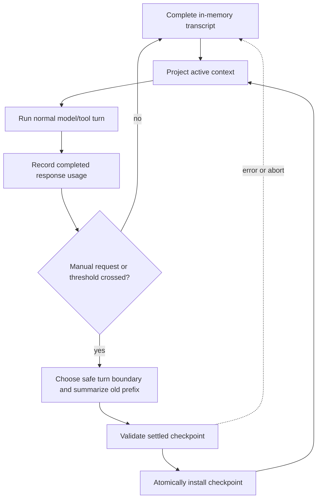

# Milestone 4 requirements: in-memory context compaction

- **Status:** approved
- **Prepared:** 2026-07-28
- **Source of truth for:** proposed Milestone 4 scope and acceptance criteria
- **Related documents:** [product map](../../PRD.md),
  [implementation-state map](../../IMPLEMENTATION_PLAN.md),
  [active implementation plan](../plans/active/milestone-4-context-compaction.md)

This document defines the approved product boundary for Milestone 4. The linked
plan is also approved, but runtime implementation starts only after one bounded
leaf is separately confirmed.

## Objective

Milestone 4 lets a long-running in-memory `yo` conversation replace an older
model-context prefix with a compact checkpoint while retaining recent complete
turns.

Trusted runtime code chooses a safe turn boundary and asks a separately
configurable model through the existing transport for a structured,
human-readable handoff summary.

```text
yo [--cwd <workspace>] [--model <name>] [--compaction-model <name>]
```

The exact `/compact` local command forces manual compaction. Automatic
compaction uses the same summarizer when reliable post-response usage and
model-window metadata show that the configured reserve has been crossed.

When `--compaction-model` is omitted, the summarizer inherits the effective
chat model. Its reasoning effort is the trusted fixed value `medium` in this
milestone. For example, a user may run
`yo --compaction-model gpt-luna` to keep the chat model and summarization model
independent.

This milestone is about model context, not durable sessions. The complete
conversation remains available to the current process for audit and deterministic
context rebuilding, but no JSONL transcript, resume command, cross-process
checkpoint, history browser, or on-disk compaction record is added.

## Why compaction precedes validation

The current chat can inspect files, propose one approval-gated patch, and
continue for multiple turns, but every prior message and tool result is sent
again. Long tool-heavy conversations can therefore crowd out the task state the
model needs for its next action.

Compaction is the next foundational state-management boundary:

```text
full in-memory transcript
    -> active context projection
    -> model request
    -> completed turn and usage
    -> optional compaction checkpoint
    -> smaller active context projection
```

Allowlisted validation remains a separate Milestone 5 draft. Compaction does
not add a process capability, general shell, validation command, or new
model-visible tool.

## Current and target behavior

### Current behavior

`ConversationState.messages` is both the in-memory transcript and the exact
provider-neutral history for the next turn. `runConversationTurn` passes all of
it to `runAgent`, and the OpenAI Codex adapter converts it into a fresh Responses
input array.

The current boundary has no:

- compaction settings;
- distinction between full transcript and active model context;
- token-usage or model-window metadata in `ModelResponse`;
- compaction checkpoint or boundary event;
- local `/compact` command;
- context-overflow recovery.

### Target behavior

After Milestone 4:

1. `ConversationState` retains the complete in-memory transcript.
2. A pure context projector derives the smaller model-visible context from the
   latest checkpoint and the complete turns after its boundary.
3. `/compact` requests a manual checkpoint without sending `/compact` to the
   model.
4. A tool-free summarization request generates a structured checkpoint.
5. A successful checkpoint is installed atomically only after the request has
   fully settled and its result has passed local validation.
6. A failed or aborted compaction leaves the previous checkpoint and active
   context unchanged.
7. The next model turn uses the new checkpoint plus messages after its boundary.
8. A later successful model response may trigger automatic compaction after the
   turn has completely settled.



## Harness-owned compaction contract

The runtime owns lifecycle, cancellation, state installation, observability,
and failure behavior. Provider code owns only normal model-request conversion
and network protocol.

The proposed checkpoint is equivalent to:

```ts
type CompactionCheckpoint = {
    boundaryMessageIndex: number
    summary: string
    tokensBefore: number
    estimatedTokensAfter: number
}
```

Checkpoint installation must be compare-and-set against the conversation
revision used to prepare it. If the transcript changes before installation,
the result is stale and is discarded. Compaction must never overwrite a newer
turn, checkpoint, cancellation, or approval resolution.

## Full transcript and active context

Compaction changes what is sent to the model, not what the current process
knows happened.

`ConversationState` must separately represent:

- the stable system prompt;
- the append-only in-memory conversation transcript;
- a monotonically increasing conversation revision;
- the latest installed compaction checkpoint, if any;
- the immutable summary-model override, if configured;
- the most recent reliable context-usage metadata.

The active context projector:

- always begins with the original stable system prompt;
- uses at most the latest installed checkpoint;
- includes only complete messages after the checkpoint boundary;
- preserves assistant tool calls together with their matching tool results;
- never turns tool output, repository text, or a compaction summary into trusted
  system instructions;
- never mutates the full transcript;
- returns detached data so transport or observer mutation cannot alter
  conversation state.

The projection contains one explicit compaction-history message followed by the
retained suffix. That message is historical data, not an instruction. Provider
adapters must serialize it with a clear fixed prefix that says it summarizes
earlier conversation state.

## Compaction preparation and summary

### Safe boundary

The compactor follows the useful mechanics of `pi` while keeping a smaller
scope:

- estimate context size from reliable provider usage when available and use a
  deterministic conservative fallback for trailing messages;
- walk backward from the newest completed turn until the fixed recent-context
  target is met;
- cut only at a complete user-turn boundary;
- never split an assistant tool call from any result produced for that call;
- never cut through an unresolved patch-approval interaction;
- carry an earlier checkpoint summary into the next summary input so
  repeated compaction is iterative rather than lossy from scratch.

Unlike `pi`, this milestone does not split an oversized turn and summarize its
prefix separately. If no safe completed-turn boundary can reduce the context,
manual compaction returns `nothing_to_compact`, and automatic compaction records
the same non-fatal outcome without retrying recursively.

The initial fixed settings are:

```ts
type CompactionSettings = {
    reserveTokens: 16_384
    keepRecentTokens: 20_000
    summaryReasoningEffort: 'medium'
}
```

The token settings and reasoning effort are trusted runtime constants in this
milestone. The model cannot change them, and no project configuration file,
free-form CLI threshold, or reasoning-effort flag is added. The separately
selected summary model is immutable for the conversation lifetime.

### Structured handoff

The model-generated summary must use a fixed operational handoff structure:

```markdown
## Current objective

...

## User constraints and preferences

...

## Key facts and decisions

...

## Files inspected or changed

...

## Tool and validation evidence

...

## Approval and mutation state

...

## Errors and attempted fixes

...

## Pending work

...

## Next recommended step

...

## Do not redo

...
```

The summary should preserve working state and remove repeated prose, stale
exploration, oversized raw output, and low-value acknowledgements.

The summarization request:

- uses the configured compaction model, or inherits the effective chat model
  when no override was supplied;
- uses fixed `medium` reasoning and the same trusted OAuth transport as the
  conversation;
- exposes no model-visible tools;
- has a separate fixed output-token budget;
- receives the previous summary, messages before the new boundary, and safe
  structured lifecycle facts needed for the handoff;
- is abortable and must settle before checkpoint installation;
- is not appended as an ordinary user turn;
- cannot apply a patch, authorize a pending patch, or run a process.

A blank, malformed, refused, transport-error, or aborted summary is a failed
compaction. The previous active context remains authoritative.

### Approval semantics

Compaction must preserve facts about mutation without preserving authority to
mutate:

- an applied patch may be summarized as applied with its safe file and hash
  metadata;
- a rejected, conflicted, or aborted patch may be summarized with that outcome;
- an approval already consumed for one exact proposal cannot authorize another
  proposal after compaction;
- no checkpoint may represent an unresolved terminal approval as approved;
- compaction cannot start while a patch approval prompt is active.

The original explicit approval path remains the only authority for applying a
future patch.

## Manual compaction command

The exact trimmed input `/compact` is a trusted local chat command. It is
handled before `runConversationTurn` and is never sent to the model.

Manual behavior:

1. reject the request if a model turn, patch approval, or compaction is active;
2. snapshot the conversation revision and active context;
3. emit `compaction_started` with reason `manual`;
4. run and settle the summarization request;
5. install the checkpoint only if the revision still matches;
6. emit one terminal `compaction_completed`, `compaction_failed`, or
   `compaction_aborted` outcome;
7. return to the input prompt without creating a user turn.

An exact `/exit` retains its existing behavior. Blank input remains a no-op.
Inputs such as `/compact now` are ordinary user tasks in this milestone rather
than hidden command variants.

## Automatic compaction

Automatic compaction runs only after a conversation turn has fully settled.
It never interrupts an active model response, tool call, patch proposal,
approval prompt, or final-answer rendering.

The trigger is:

```text
reliable active-context tokens >
    known model context window - reserveTokens
```

Reliable active-context tokens use provider-reported usage from the latest
completed response plus a deterministic estimate of any trailing local
messages. The provider transport must identify whether usage describes the
current post-checkpoint context.

If the model context window is unknown, usage is missing or stale, or the last
response failed before trustworthy usage arrived, automatic compaction is
skipped. Manual `/compact` remains available.

Only one automatic compaction may be attempted for the same conversation
revision. Automatic failure does not retry or prevent the next user prompt.
Context-overflow detection and automatic compact-and-retry of the failed model
turn are explicitly deferred.

## Events and terminal behavior

Extend the lifecycle with bounded events equivalent to:

```ts
type CompactionReason = 'manual' | 'threshold'

type CompactionOutcome = 'completed' | 'nothing_to_compact' | 'stale' | 'aborted' | 'failed'
```

Events may contain:

- reason;
- safe outcome;
- conversation revision;
- tokens before and estimated or reported tokens after;
- number of complete turns summarized and retained;
- sanitized error code.

Events must not contain:

- summary text;
- raw transcript messages or tool output;
- hidden reasoning;
- OAuth credentials or headers;
- raw external error objects.

The terminal renderer shows one-line bounded statuses, for example:

```text
status: compaction_started reason="manual"
status: compaction_completed before=143200 after=18700
```

Automatic compaction occurs only after final-answer output has been finished,
so status text cannot split or duplicate the answer.

## Cancellation and failure behavior

Manual and automatic compaction receive an `AbortSignal`.

- Abort must propagate to the summary request.
- The summarization request must settle before it reports an aborted result.
- Late success after abort cannot install a checkpoint.
- Transport, schema, refusal, and provider errors are sanitized.
- A failed compaction does not fail or roll back the already completed user
  turn.
- No recursive compaction may run while generating the `yo` summary.
- At most one compaction operation may be active per conversation.

## Scope boundaries

Milestone 4 does not add:

- append-only JSONL sessions, resume, fork, archive, or cross-process history;
- selective user picking, grouping, annotating, deleting, or reordering of
  arbitrary prior messages;
- configurable compaction reasoning effort, custom compaction prompts, or
  project configuration;
- mid-turn compaction or oversized-turn prefix summarization;
- context-overflow compact-and-retry;
- provider fallback, API-key authentication, or multi-provider support;
- a model-visible `compact` tool;
- validation, shell, process, network, connector, MCP, skill, or subagent
  capability.

Milestone 5 remains the separately drafted allowlisted validation capability.

## Risks and mitigations

### Summary loss or hallucination

The structured summary can omit or distort old facts.

Mitigations:

- retain recent complete turns;
- use a fixed structured handoff;
- include deterministic safe lifecycle facts;
- test adversarial transcripts and repeated compaction;
- keep the full transcript in memory for the current process;
- install only a non-empty settled summary.

### Broken tool-call pairing

Cutting between a tool call and its result produces invalid provider context.

Mitigation: boundary selection and context projection treat a completed turn
and every call/result pair as indivisible; focused tests cover multiple calls,
errors, denials, timeouts, and approval-gated patches.

### Stale concurrent installation

A compaction result could arrive after state changed.

Mitigation: capture a conversation revision and install with compare-and-set.

### Prompt-cache disruption

Rebuilding context changes the request prefix and may reduce prompt-cache reuse.

Mitigation: keep stable instructions and tool definitions ordered before
dynamic history, compact only at meaningful thresholds or explicit user
request, and record before/after usage for later evaluation.

## Verification

### Focused deterministic coverage

Tests must cover:

- summary-model parsing plus immutable conversation selection;
- exact `/compact` routing and rejection while busy;
- conservative token estimation and trustworthy-usage selection;
- complete-turn boundary selection;
- assistant tool-call/result pairing;
- previous-summary iteration;
- summary prompt structure and no visible tools;
- blank, refused, malformed, aborted, and failed summaries;
- full transcript retention and active-context projection;
- detached state snapshots and revision compare-and-set;
- approval facts without approval authority;
- manual and threshold event order;
- no recursive or duplicate compaction;
- repeated compaction with inherited and explicit summary models;
- normal next-turn continuation after each successful checkpoint.

### Project checks

Each runtime leaf runs its focused tests first, then:

```text
npm test
npm run build
npm run format:check
git diff --check
```

The final leaf also requires a user-controlled real ChatGPT OAuth smoke:

1. start `yo --compaction-model <name>` in a safe workspace;
2. create enough deterministic conversation state to compact;
3. run `/compact`;
4. verify bounded completion metadata without summary content;
5. ask a follow-up grounded in pre-compaction state;
6. verify the normal Responses turn completes through the summary checkpoint.

## Acceptance criteria

Milestone 4 is complete only when:

- the requirements and active plan were approved before runtime work;
- each bounded `10.x` leaf was implemented, reviewed, and verified separately;
- the full in-memory transcript is distinct from the active model context;
- compaction preserves a structured operational handoff and recent complete
  turns;
- an explicit compaction model is used with fixed `medium` reasoning,
  while omission inherits the effective chat model;
- manual `/compact` works without creating a model-visible user turn;
- threshold compaction runs only from trustworthy metadata and never
  recursively;
- compaction cannot preserve or create patch authority;
- failures and aborts leave the previous active context unchanged;
- deterministic suites and all project checks pass;
- durable sessions, validation, overflow retry, selective history editing, and
  every other deferred capability remain absent.
