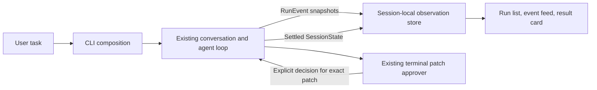

# Milestone 4 requirements: in-memory run observation

- **Status:** first-version direction endorsed; 10.1 reviewed; 10.2 complete after checks and independent review
- **Prepared:** 2026-10-01
- **Source of truth for:** remaining, unconfirmed Milestone 4 scope (10.3–10.4) and deferred proposals
- **Related documents:** [product map](../../PRD.md),
  [implementation-state map](../../IMPLEMENTATION_PLAN.md),
  [active implementation plan](../plans/active/milestone-4-run-observation.md)

## Requirement ownership after OpenSpec adoption

The [OpenSpec run-observation specification](../../openspec/specs/run-observation/spec.md)
is the sole current requirement source for implemented leaves **10.1–10.2**.
Descriptions of that implemented behavior below are retained as historical
design and acceptance context; do not update them as a parallel specification.
Change that behavior through OpenSpec and follow the [development workflow](../openspec.md).

This document remains authoritative for the **proposed, unconfirmed** remainder:
between-turn selection/navigation (10.3), full first-version closure and review
(10.4), their milestone-wide acceptance criteria below, and deferred directions.
Those criteria describe completion of the entire milestone, not current runtime
capabilities. In particular, historical-run inspection is not implemented.

On 2026-10-02 the user endorsed the first-version direction and explicitly
confirmed implementation of leaf 10.1 only. The user reviewed and accepted its result on the same date.
The user subsequently accepted the live 10.2 presentation and separately
explicitly authorized its implementation. The user instructed finishing and committing it after independent review; checks passed and both review findings are closed. Leaves 10.3–10.4, cancellation, rerun, and validation remain unconfirmed.
Navigation syntax and selection layout require a decision before 10.3.

## Objective

Make the existing agent execution understandable in the terminal: show a list
of turns in the current session, an ordered event feed for each turn, and a
result card with errors and patch-approval outcomes.

One submitted user task is one run, even when it contains several model steps
and tool calls. Runs execute sequentially in the existing in-memory chat.

The first version adds observation only. Later increments add cancellation,
then explicit rerun, then validation results through the separately reviewed
[Milestone 5](milestone-5-allowlisted-validation.md).

## Current and target behavior

The existing `runAgent` records structured `RunEvent` values and sends detached,
immutable snapshots to `onEvent`. The terminal renderer shows live model/tool
status, final text, and an evidence report. Patch approval uses a separate
trusted callback that displays the exact diff and reads explicit consent.
Through 10.2 the CLI retains session-local run records and prints their summaries
beneath each result. Selecting a prior run remains future 10.3 behavior.

After this milestone, a session-local observation store retains the ordered
runs and their display state. It receives existing lifecycle events while the
run executes and is finalized from the settled `SessionState`. A terminal view
lets the user inspect prior turns without sending inspection input to the
model or changing the conversation history.

## Presentation

### Accepted live presentation for leaf 10.2

The accepted layout is a run-number/task-preview/local-start-time header,
numbered event rows, and a separate current-state/elapsed-time line. Interactive
terminals replace that state line; non-TTY output writes separate lines, with
no color dependency or timer. State changes derive from events; timing freezes
from settlement before answer printing. Clock failure displays `unavailable`.

Preserve full answer delivery once through the existing renderer. Afterwards
print one compact result card and the current-session list. The card includes
status, reason, time, tools, files, errors, and patch-state trails, but does not
print the stored answer preview again. Replace legacy operational status lines
rather than duplicating them. The full trusted patch diff and approval prompt
remain unchanged. Presentation acceptance preceded implementation. Completion rests on passed checks, independent review, and the user’s subsequent instruction to finish and commit after review; no manual code review is claimed. No past-run selection is included yet.

### Run list

- Assign each submitted task a monotonically increasing session-local number.
- Show a safe task preview, active or terminal status, and stop reason.
- Show the start time and elapsed duration; freeze the duration when the run
  settles. Use an injected wall clock for start time and a monotonic clock for
  duration so clock adjustments do not produce negative elapsed time.
- Distinguish a failed transport, budget exhaustion, and a completed answer.
- Retain earlier runs until the process exits; restarting starts an empty list.
- Allow inspection of settled runs between turns. Exact navigation syntax and
  selection layout must be settled during plan review before leaf 10.3.
- Keep one active run; no queue, concurrent runs, or background jobs.

### Event feed

- Preserve runtime order for model requests/responses, tool requests,
  permission decisions, tool outcomes, patch lifecycle, and run completion.
- Identify tool events by call ID and model step; do not merge unrelated calls.
- Show permission denial, invalid arguments, timeout, and execution failure as
  distinct outcomes. A tool failure need not mean the whole run failed.
- Use safe summaries and bounded previews; never dump raw arguments, transport
  payloads, credentials, or hidden reasoning.
- Preserve tool-output truncation on completion rows: show the flag and, when
  validated details are available, reason, limit, and observed count. Keep a
  generic truncation warning if details are absent; retain no raw tool output.
- Keep final-answer text in the answer/result view rather than displaying each
  text delta as a separate operational feed row.
- Isolate observer and rendering failures from runtime execution and results.
  A failed progress cleanup must not allow subsequent cleanup to erase already
  delivered answer fragments, whether clearing the line or moving the cursor failed.

### Result card and approval

- Show the final answer when available, completion status and stop reason,
  files/tools used, and relevant errors based on structured evidence.
- Show patch preparation, waiting for approval, approval or denial, conflict,
  and confirmed application as separate states.
- Preserve the complete diff and existing explicit terminal approval prompt.
  Viewing a historical approval never approves a new action.
- Render transport failure from the existing safe `transport_error` reason;
  do not invent diagnostics the runtime did not record.
- Treat reaching the step budget as budget exhaustion, not user cancellation.
- Finalize a run once and preserve partial observations when it fails.

### State transitions and accessibility

The observation lifecycle is `running` followed by one settled outcome derived
from the runtime status and stop reason. Active model work, tool work, and
waiting for patch approval are activity states within a running run, not new
terminal outcomes. Approval or denial can return the run to active work.

A settled record cannot become running again. Finalization is idempotent;
late display updates cannot overwrite the settled outcome or attach themselves
to a newer run. These display guards must not suppress runtime observations or
change the transcript. Repeated calls to the same tool remain distinct calls.

All local inspection and approval actions are available from the keyboard.
Statuses and available actions have text labels; color alone never conveys
success, failure, or waiting. Cover both interactive and non-color/non-TTY
presentation with deterministic checks.

## Component and data flow

The observation store is a display projection, not authoritative runtime or
model-context state. It cannot authorize tools, apply patches, alter budgets,
or modify the transcript. CLI composition owns run numbering and connects the
existing runtime observer, terminal renderer, and observation view.

`pi` provides the relevant separation: its interactive mode subscribes to
`AgentSession` events while the session owns execution and control. Reuse that
boundary, with the smaller `yo` scope of one terminal session and no persistence,
extensions, RPC server, or new model-visible capability.

### Same-process initialization invariant

The user agreed on 2026-10-02 that CLI composition must first create and
save the run record, then prepare/connect an observer bound to its identity,
then invoke the existing conversation/agent turn. Even a synchronously emitted
initial event must find the record and observer. Feed updates follow; only the
settled session finalizes the record. This follows `pi` subscription-before-task
ordering within one process; no buffering, replay, persistence, or network
mechanism is needed.

A missing record is an integration error, distinct from an already settled
record's expected late-update guard. Leaf 10.2 makes absence observable
through a safe trusted CLI/observation diagnostic path. Observer or diagnostic
failures must not fail execution, authorize actions, alter patch consent, or
change the transcript. Do not expose raw event data or sensitive diagnostics.

Currently `updateObservedRun` leaves history unchanged for an absent ID and
skips updates for settled records. Leaf 10.2 now adds safe missing-record diagnostics and initialization wiring
at CLI composition, keeping the pure helper unchanged.

Reproducible integration checks use a synchronously emitting faux runtime
to verify record creation/insertion and observer preparation before invocation,
correct run identity, distinct missing/settled handling, and execution isolation
when observers or diagnostic writers fail. No paid requests or real timing waits
are required.

## Scope and deferred work

Included: current-session run list, event feed, result cards, existing patch
approval presentation, terminal integration, and deterministic verification.
Non-interactive output must remain useful and deterministic.

Deferred beyond the first version:

1. **Cancellation:** a trusted run controller propagates cancellation through
   the loop, transport, and active tool/approval operation, settles work, and
   records a truthful cancelled outcome. Show cancellation requested while
   waiting for settlement; show cancelled only after runtime confirmation.
   Resolve a completion/cancellation race from the controller's actual settled
   result, preserving completion if it won. Already applied patches remain applied.
2. **Explicit rerun:** a user command starts a new run linked to its source.
   Specify whether context comes from the original run or current conversation
   before implementation. Use current workspace state and fresh patch approval;
   no automatic retry or inherited consent. Retain the previous attempt and
   prevent repeated submission of the same pending rerun action from creating
   accidental duplicate runs; allow a deliberate later attempt.
3. **Validation results:** Milestone 5 introduces only `test` and `build` and
   displays their structured outcomes in the feed and result card. No test
   execution is implied by the first observation version.

Each increment needs separate requirements/plan review and bounded-leaf
confirmation. Persistent history, resume, parallel runs, arbitrary commands,
automatic repair/retry, browser UI/server, and new UI dependencies are outside
this milestone.

## Risks and validation

Use the existing faux model-transport and injected CLI boundaries to build
reproducible success, transport-error, tool-error, delayed-response, and
approval-waiting scenarios. Drive delays through controlled promise settlement,
not real network calls or timing-dependent sleeps. Use temporary fixture
workspaces for patch scenarios. Reuse these scenarios for automated checks and
a repeatable terminal demonstration without OAuth or paid model requests.

These tests verify the observation interface and state transitions. They are
part of Milestone 4; agent-executed repository `test`/`build` remains Milestone 5.

- Display state may diverge from runtime: derive it from ordered snapshots and
  settled results; test repeated tool names, multiple calls, and failed runs.
- Inspection input may become a model task or approval response: keep local
  navigation between turns and preserve exclusive ownership of approval input.
- Error or argument rendering may leak unsafe data: use locally validated safe
  fields, bounded previews, and the existing secret-conscious rendering rules.
- Retained display data may duplicate large tool output: retain lightweight
  summaries rather than another full transcript or unbounded output copy.
- Start-time clocks may move backward or elapsed updates may arrive late:
  compute elapsed time monotonically and freeze it at the first settlement.

Milestone 4 is complete only when:

1. Multiple turns are inspectable in order during one process lifetime, with
   deterministic start times and non-negative elapsed durations that stop
   changing after settlement.
2. Events are associated with the correct run, step, and tool call.
3. Each run settles once with the actual status and stop reason; duplicate
   finalization, late updates, and selection changes cannot overwrite results
   or mix events between runs.
4. Tool failures, transport failure, and budget exhaustion render accurately.
5. Approval waiting, denial, conflict, and application match runtime evidence;
   the exact diff and explicit-consent boundary remain intact.
6. Observation and navigation do not change model messages, permissions, or
   runtime outcomes; rendering failures cannot fail the run.
7. Deterministic multi-turn, event-order, approval, and failure checks pass,
   along with `npm test`, `npm run build`, `npm run format:check`, and
   `git diff --check`.
8. Keyboard-only inspection and approval work, and statuses remain clear
   without color.
9. Reproducible success, failure, delay, and approval-waiting demonstrations
   use controlled faux transports and fixtures; the terminal flow is reviewed
   before marking the milestone complete.

## Design source

The [Practical cases Page](https://chatgpt.com/space/page_2a8214f5756481919478bc2b8d020a4a)
informs timing, reproducible scenarios, state transitions, accessibility, and
the later cancellation/rerun rules. Its React/HTTP/SSE implementation and
connection-recovery scenario belong to a possible separate web interface, not
this terminal milestone.
