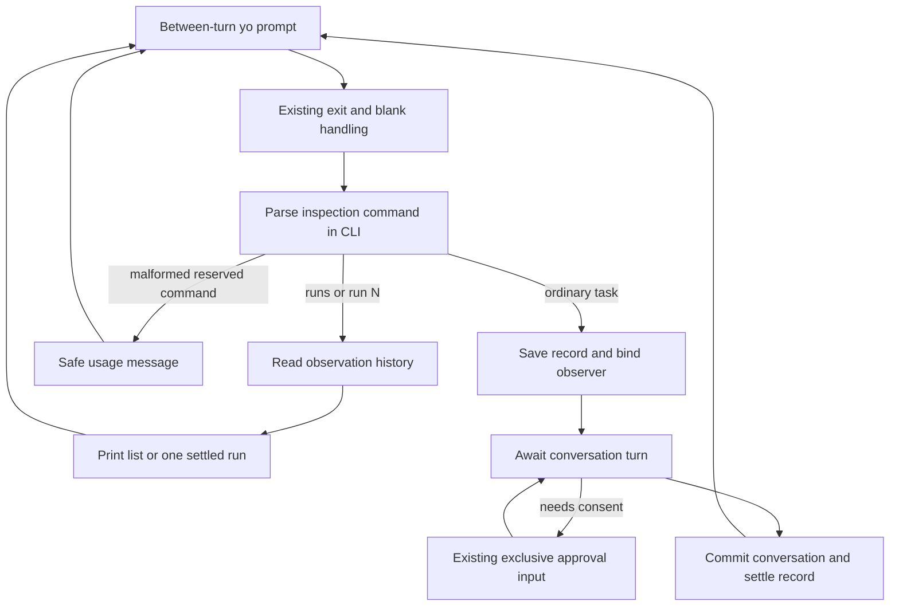

# Design

## Context

See [proposal.md](proposal.md) for motivation and the bounded leaf. The user
selected `/runs`, `/run N`, and the retained-answer layout on 2026-10-02.

Currently `runChatInput` in `src/line-input.ts` ignores blank input, exits only
on exact `/exit` or EOF, and awaits `onMessage` before reading another chat
line. `src/cli-app.ts` creates an observation record immediately inside that
callback, invokes the turn, commits its conversation result, then settles the
record. The patch approver reads the same input while the callback is awaited;
non-TTY approval is denied without reading a response.

`src/observation-session.ts` already exposes `getHistory()`. Records contain
safe previews, ordered feed rows, call associations, frozen timing, and result
cards. `src/terminal-observation.ts` already formats feed rows and live result
cards; the latter currently appends the session list. The retained answer is
bounded to 16,000 characters and live result cards intentionally omit it.
No new record format or transcript copy is needed.

The main spec currently forbids historical-run selection. The delta replaces
that restriction with between-turn selection within this process and clarifies
that explicit preview inspection is separate from once-per-turn answer delivery.

## Goals / Non-Goals

**Goals:** route a local command before record creation, read one stable history
snapshot, and render it without changing execution state. Keep parsing and
formatting pure and use existing CLI injection seams for deterministic tests.

**Non-Goals:** no persistent selected-run state, new event subscription, replay,
background input reader, expanded answer retention, or changes to runtime,
provider, permissions, and approval policy. Scope/deferred features are listed
in the proposal; full Milestone 4 closure remains leaf 10.4.

## Decisions

### Recognize commands at CLI composition before creating a run

Add a small `src/observation-command.ts` parser returning a discriminated `type`:
list, inspect with numeric ID, invalid inspection command, or ordinary message.
Trim only a parsing copy. Recognize exact case-sensitive `/runs` and `/run`
tokens separated by spaces/tabs; validate a single canonical positive decimal
and `Number.isSafeInteger`. Preserve the original line for ordinary messages.
The delta specifies edge cases, including leading-zero and overflow rejection.

In `cli-app.ts`, handle those three local outcomes at the start of `onMessage`
and return before `observations.begin`, `runTurn`, or clock sampling. Unknown
numbers and defensive running-record selection produce fixed safe messages.
Rendering and diagnostic writes are individually isolated; a consumed command
never falls through to model submission even if output fails. Do not echo raw
malformed input in diagnostics.

This keeps `line-input.ts` generic and preserves its exact `/exit` semantics.
An alternative global slash-command framework would broaden the change and
could capture unrelated prompts. A second input loop would compete with patch
approval. Neither is needed for two local commands.



### Share formatting while keeping explicit inspection separate

Extract a reusable session-list formatter and a result-card-only formatter
from `terminal-observation.ts`. Preserve the live result layout through its
existing public wrapper; do not reprint the retained answer automatically.
Add a selected-run formatter that composes header, existing feed-row formatter,
retained-answer section, and card-only output. It prints neither other runs'
events nor an appended session list. `/runs` includes stop reasons and a short
usage line; the shared automatic list may include these same useful fields.

All inspection output uses durable `writeOutput` text in both TTY and non-TTY
modes, never progress-line replacement or runtime answer callbacks. Read only
projected fields. Use the stored truncation flag and null answer value; do not
search conversation messages for missing text. Reuse the existing unavailable
time labels. A fresh prompt provides the return path, so no back command or
selection state is necessary.

Example layout (illustrative fixture data; wording may be refined without
changing required fields):

```text
yo> /runs
Session runs:
- #1 Inspect entrypoint | completed | reason=final_answer | start=12:00:00 elapsed=0.050s
- #2 Explain failure | failed | reason=transport_error | start=12:00:01 elapsed=0.025s
Inspect: /run N | List: /runs
yo> /run 1
Run #1: Inspect entrypoint | start=12:00:00
Events:
event: run=1 #1 run_started
...
Retained answer:
The entrypoint is ...
[Answer preview truncated, when recorded as truncated]
Run #1 result: completed
Elapsed: 0.050s
Evidence:
Stop reason: final_answer
Tools: ...
Files: ...
Errors: ...
Patches: ...
yo>
```

Alternatives: rendering the full conversation would expand retention/access
scope; an arrow-key selector would require another interaction model and
non-TTY fallback. The user selected the smaller text-command interface.

### Retain the pi separation between local interface and execution

In `../pi/packages/coding-agent/src/modes/interactive/interactive-mode.ts`, the
editor handler consumes local commands such as `/tree` before model submission
(around line 2693). Its event subscription delegates execution to
`AgentSession.subscribe` in `../pi/packages/coding-agent/src/core/agent-session.ts`
(around line 779). These are the relevant boundaries: interface commands and
event presentation remain separate from execution.

`yo` uses those boundaries with an awaited line callback and its existing
observation snapshot. It does not adopt pi's tree navigation, conversation
branching, persistence, or TUI machinery. Inspecting an old run never switches
the model's conversation branch.

## Risks / Trade-offs

- Commands reaching the model → consume valid and malformed reserved tokens
  before record creation; compare captured model requests against a control flow.
- Competing with approval → reuse the sequential chat callback; verify pending
  turns start no new chat read and command-like approval input is consumed only
  by the existing approver. It denies such input under the existing vocabulary.
- Mutating history or timing → format a snapshot without sorting in place,
  updating records, or sampling clocks; compare records and repeated views.
- Leaking or mixing evidence → render only safe projected fields with existing
  call numbering; test repeated tool names, truncation, unsafe previews, and
  failed runs independently.
- Display failure terminating chat → isolate local output and diagnostic
  errors; test a subsequent task still executes with the same transcript.
- Long session output → retained answers stay bounded, but the existing event
  feed and run count remain session-sized. Paging and retention limits are
  deferred; this change does not promise a globally bounded session history.
- Reserved tokens were previously tasks → document the compatibility change;
  unrelated slash text remains untouched. No new escape syntax is introduced.

## Validation

Use pure parser cases, formatter fixtures, and the existing injected CLI/faux
transport harness. Cover empty history, malformed commands, unknown/running
selection, completed/failed/budget runs, switching, absent/truncated answers,
tool truncation, safe fields, frozen/unavailable time, and session reset.

Compare model requests and run IDs with and without navigation. Use controlled
promises to prove there is no concurrent read during model/tool work. Extend
interactive approval fixtures for command-like input, later inspection, and
fresh explicit approval; retain non-TTY denial and exact diff assertions.
Inject inspection/diagnostic output failures and then submit another task.

Run focused tests and the existing faux demo, then `npm test`, `npm run build`,
`npm run format:check`, `npm run spec:check`, and `git diff --check`. Review the
10.3 result before marking tasks complete. No live OAuth, paid calls, or actual
clock waits are required. Record physical TTY behavior as unverified unless
it is exercised; automated TTY-mode checks are not physical-terminal evidence.

## Migration Plan

Implement only after the user confirms applying this bounded change. Build and
verify the parser/formatters, then CLI routing and isolation, then regression
flows and usage/demo updates. Record checks and result review before marking
10.3 complete; do not mark 10.4 or the entire milestone complete.

During implementation, link the change from the maps and active plan as proposed
or in progress. After verified spec sync, update the baseline Purpose, maps,
adoption guide, and historical requirements' ownership notes so 10.3 has one
current requirement source and 10.4 stays pending. Preserve earlier evidence.
Archiving follows the separate completed-change workflow. Rollback can remove
the command route and new formatters without data migration because history
exists only in memory; document that reserved tokens become task text again.
