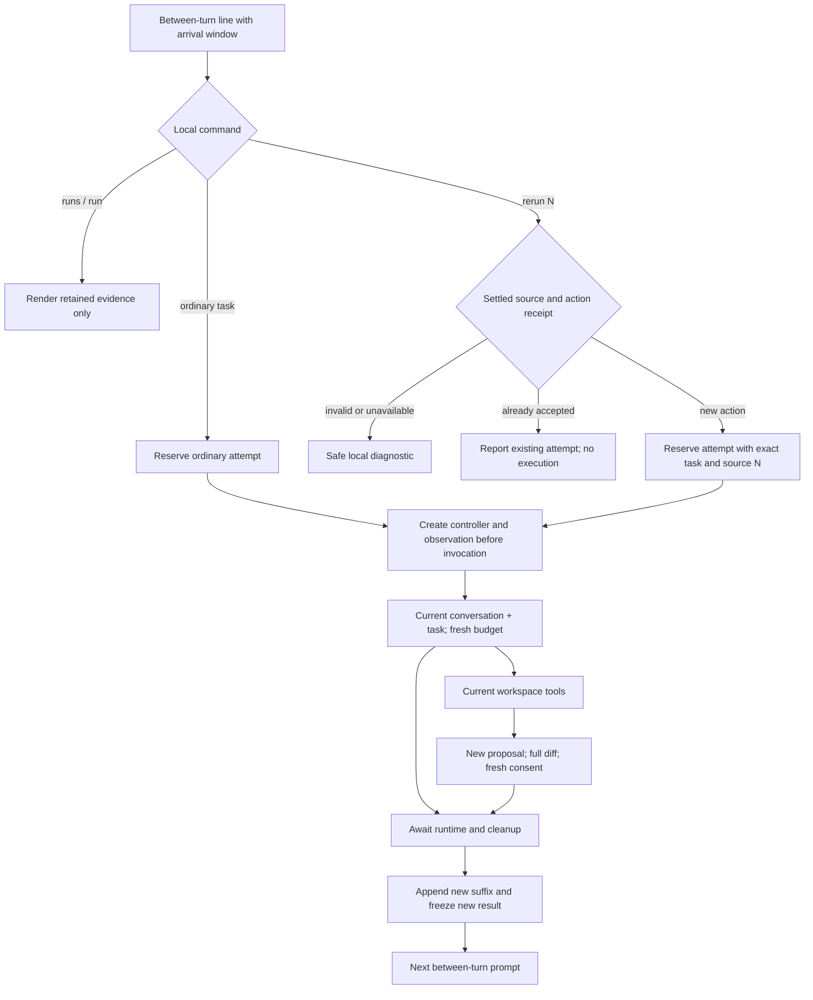

# Design: Explicit rerun of settled runs

## Context

See [proposal.md](proposal.md) for motivation, acceptance criteria, authorization,
and deferred scope. This is a proposed design, not implemented behavior.

### Current behavior and component roles

`src/cli-app.ts` creates one conversation and awaits each turn. It handles local
inspection before model submission, creates a cancellation controller, prepares
observation, and then invokes `runConversationTurn`. On returned settlement it
appends the turn's suffix and renders a result. A transport failure, cancellation,
or exhausted budget returns to input; an unexpected invocation exception closes
chat through the existing `ChatTurnError` path.

`src/runtime/conversation.ts` already passes the current transcript as initial
messages, adds the task through the ordinary loop, and appends only the resulting
suffix. It clones structured messages and preserves the session workspace/model.
This is the execution path rerun needs; it does not need an old loop checkpoint.

`src/observation-session.ts` currently allocates run numbers in `begin(task)`.
`src/run-observation.ts` retains a sanitized 160-character task preview rather
than the full task, and freezes settled evidence and timing. Display callbacks
are isolated from execution. `src/terminal-observation.ts` formats that record
for live status, lists, result cards, and retained inspection.

`src/line-input.ts` has one reader shared by chat and patch approval. Native
readline buffers complete lines without an owner. Sequentially awaiting a turn
prevents concurrent reads but does not stop two buffered `/rerun N` lines from
being delivered as two later submissions. Existing cancellation discards partial
and buffered input until the next read; that cleanup must keep working.

### Target flow in plain language

At the between-turn prompt the user selects `/rerun N`. The trusted CLI resolves
N to an immutable full task and confirms that its source has settled. It checks
whether this action has already been accepted. A new action gets a new run number
and a copied source link before any callback can run. The CLI creates the normal
controller and display record, then sends the original task using the current
conversation. The runtime starts from step zero with the usual budgets, reads
present files when requested, and prepares new patch proposals when requested.

Settlement appends only the new suffix, saves the new attempt's outcome, and
freezes its display result. The original source is never reopened or overwritten.
Inspection stays read-only. Each patch still requires the complete newly prepared
diff and a fresh affirmative response at the approval prompt.

## Goals / Non-Goals

**Goals:** make task selection an explicit trusted control action, give one action
one attempt identity, and keep execution state independent of lossy display data.
Reuse existing conversation, runtime, cancellation, and patch boundaries.

**Non-Goals:** recover an old model request or tool batch, reproduce prior model
output, make workspace state transactional, or introduce a second execution loop.
The source is a task reference, not an approval token or filesystem snapshot.
There is one context policy and no user-facing policy selector in this increment.

## Decisions

### 1. Use the current conversation and exact source task

The user selected current conversation on 2026-10-03. Snapshot the current
conversation for the accepted invocation and pass the source task unchanged to
`runConversationTurn`. The request contains the earlier source attempt, intervening
turns, and their structured results once, followed by one new user message with
the exact source text. Append only the returned suffix. Do not add `/rerun N`,
window identifiers, or a synthetic control message to the transcript.

Historical observations remain historical context. Rerun does not guarantee that
the model rereads every file, but every tool execution uses present workspace
state and no cached source tool result is substituted for a new call. Tests force
a new read after an external edit to prove this boundary.

The alternative, original-context replay, would require retained pre-turn snapshots
and a policy for merging a branch into the current conversation. It can ignore
later corrections and does not fit the selected scope. A plain `continue` would
resume a previous trajectory instead of repeating the task with fresh budgets.

### 2. Keep an execution catalog outside observation

Introduce a small session-local trusted catalog, provisionally `src/chat-runs.ts`.
It owns increasing positive safe run numbers and immutable attempt entries:
number, full task, direct source number or null, fixed context policy for reruns,
and execution settlement state. Only trusted returned turn outcomes mark a source
settled. Catalog reads return detached immutable values; callers cannot mutate a
source or its identity. It stores no old proposal, consent, or complete session
copy. Full task text is already part of the in-memory conversation; keep this
small additional execution lookup private and discard it with chat.

Move number allocation from observation to this catalog when wiring execution.
Observation `begin` will receive the catalog's number, task for existing safe
preview creation, and numeric source metadata. Reserve the catalog entry before
observation callbacks, and install the controller before invoking work, preserving
the current synchronous-event and cancellation safeguards. There is one allocator
for ordinary and rerun attempts, not independently advancing counters.

Valid sources include completed, transport-failed, budget-exhausted, and cancelled
returned turns, including a settled rerun. Selecting a rerun links directly to
that selected attempt, not its oldest ancestor. Unknown or unsettled entries are
rejected before allocation. An unexpected invocation exception retains existing
safe failure/exit handling; adding recovery from such exceptions is out of scope.

Taking the task or eligibility from `RunRecord` was rejected: the preview is lossy,
and display projection must have no execution authority. Extracting a task by
searching for matching user text was rejected because identical tasks and later
turns are ambiguous. A new catalog does not become a model tool or a persistence
layer.

### 3. Recognize `/rerun N` locally with existing command grammar

Reserve the exact lowercase `/rerun` token. Accept surrounding whitespace and
space/tab separators, exactly one `[1-9][0-9]*` safe-integer source number, and
no extra tokens. Malformed reserved input produces usage locally. `/rerunner` and
`/RERUN 1` remain ordinary text. Keep exact `/exit`, blank-input handling, and
the original whitespace of ordinary tasks unchanged.

Use a small separate rerun parser, provisionally `src/rerun-command.ts`, beside
`src/observation-command.ts`. The CLI routes it before ordinary task submission;
the observation formatter does not get an executable command variant. Inspection
help may show `/rerun N` but only the trusted CLI acts on it. The parser alone
never allocates, reads history, or invokes the model.

At a patch approval prompt `/rerun N` is consumed as nonaffirmative input, just
like `/run N`. It denies the displayed patch and is not replayed later. The
command is not a top-level `yo` subcommand or a permission for any tools.

### 4. Give duplicate actions an identity at input arrival

A sequential callback alone is insufficient because buffered duplicate commands
can arrive after the first attempt has settled. Define a trusted **arrival
window**: a monotonically increasing identity opened by each between-turn prompt.
Attach that identity to a complete input line when readline receives it, not
when a later read removes it from the buffer. Buffered lines retain their arrival
identity even when a new prompt opens. Lines arriving during active work without
an approval reader retain the last chat window; approval reads do not create chat
windows. Startup buffered input uses a defined initial window.

Add a chat submission envelope `{ line, windowId }` through an additive chat-read
path on `LineInput`; keep the existing string `readLine` contract for approval
and existing general consumers. Both paths share one pending owner and buffer.
Pass the trusted window through `runChatInput` to the CLI without putting it in
the model context. Native and injected chat readers must supply real arrival
identities for rerun; a legacy reader without that capability may continue
ordinary tasks/inspection but must reject rerun locally with an input-capability
diagnostic rather than inventing per-dequeue identities. Update the repository's
CLI/demo test readers to implement the new path where rerun is exercised.

The rerun action key is `(windowId, selected source number)`. Reserve its receipt
and attempt atomically before callbacks or awaits. Repeated delivery returns the
existing attempt number with a safe local diagnostic and no budget, controller,
observation allocation, or execution. Keep receipts after settlement so queued
duplicates cannot become new attempts. An identical command received after a
fresh post-settlement prompt gets a new window and is a deliberate later attempt.
Ordinary task text is never deduplicated. A different source number is a different
selection and remains subject to sequential execution and source validation.

Receipts are session-local small numeric records. Release them only when their
input window can no longer be delivered, or retain them until session exit; do
not retain raw input strings in receipts. Cancellation clears buffered envelopes
alongside strings and invalidates partial input, while an accepted receipt stays
consumed. Late callbacks cannot reopen a receipt or source. At EOF drain buffered
ordinary input under existing rules, and suppress repeated rerun deliveries even
when no more prompts receive fresh input.

Alternatives rejected: deduplication by task text would block deliberate repeats;
removing receipts at settlement would replay buffered duplicates; blanket buffer
discard would silently lose ordinary tasks, inspection, and exit input. Wall-time
debouncing would make correctness depend on typing speed and race timing.

### 5. Project only safe immutable provenance

Add source number and the literal `current_conversation` policy to rerun display
records; ordinary records have no rerun provenance. Render `Rerun of #N` and
`Context: current conversation` in the header, result card, list row, and retained
inspection of the new attempt. Do not append a child list or event to the old
source. The operational feed continues to contain runtime events only.

Keep sanitization, 160-character task previews, answer bounds, call association,
and frozen timing. Late events for either attempt cannot change the other.
Display/clock failures cannot decide eligibility or undo an accepted receipt.
The linkage is set before the first synchronous event and copied immutably through
projections and settlement. It does not need runtime `RunEvent` fields, provider
payload fields, or tool schemas. A text-only list and inspection remain usable
without color or cursor controls.

### 6. Reuse execution and patch authorization for every attempt

An accepted rerun follows the same controller/observation/turn path as ordinary
tasks: ten model requests, 5,000 ms per-tool execution, approval time excluded,
and full cleanup settlement before the next chat read. Never reuse an aborted
signal. Failure or cancellation does not schedule another attempt. Inspection
and malformed commands cannot trigger retries.

Old patch results remain context and evidence only. The rerun model may propose
a new patch, which goes through existing preparation, complete preview, consent,
revalidation, and atomic replacement. No proposal or approval object is replayed.
Already-applied bytes are neither rolled back nor reapplied by the rerun command.
Non-TTY rerun is allowed as ordinary task execution, but non-TTY patch consent
remains denied. Changed-source conflicts keep their existing behavior.

### 7. Relationship to pi

`../pi/packages/coding-agent/src/core/agent-session.ts` owns `prompt` and `abort`,
and its `abort` waits for idle. Its interactive mode handles user-message
selection for forking and restores selected text to the editor. These support
the separation of trusted session control, submitted task text, and terminal
presentation used here. They are reference patterns, not an identical `/rerun`
contract. Pi's persisted branches, steering/follow-up queues, extensions,
compaction, and automatic retry machinery are deliberately outside this change.
Yo keeps one sequential in-memory conversation and exact per-proposal approval.

## Risks / Trade-offs

- Current context may contain stale file observations or later conflicting
  instructions → show the chosen policy; preserve historical messages without
  claiming they are fresh; execute new reads and patches against current bytes.
- Buffered input can be mistaken for a new intentional action → retain arrival
  windows at ingress and verify the native reader, not only mock callback order.
- Reader metadata can disturb approval/cancellation → share one owner, keep
  approval string reads, and rerun all input and cancellation regression checks.
- Raw task lookup can leak through display → pass only existing safe previews
  plus numeric provenance; test long and sensitive-looking tasks against output.
- Moving run allocation can shift existing numbers or fail under reentrancy →
  reserve before callbacks, use one allocator, and test synchronous observation
  events, duplicate delivery, safe-integer bounds, and clock/render failures.
- Repeated tasks can propose repeated side effects → do not replay prior calls or
  consent; retain exact matching and fresh complete-diff approval on current bytes.
- Input action semantics distinguish fresh prompts from a pasted batch → document
  this rule in command help and demonstrate buffered duplicates versus fresh input.
- Catalog/tasks/receipts grow with an in-memory session → store only task and
  small numeric identity/state, avoid snapshot copies, and discard on exit. General
  history limits/compaction remain separate work.

## Migration Plan

Introduce independently verifiable pure parser/catalog contracts first, then
reader arrival identities, display provenance/explicit identity injection, and
finally wire the command through the existing turn path. Keep each group checked
and reviewed before the next; no runtime behavior is enabled by artifact status.
No persisted state or external API migration is required. Feature rollback is a
code reversion and never undoes workspace patches already explicitly applied.
At accepted closure synchronize the two verified deltas, update maps, and archive.

## Validation

Use focused node tests for parser/catalog and native reader behavior. Integration
tests use the actual conversation/loop with faux transport and temporary files:
all eligible outcomes, exact long/whitespace task reuse, intervening context,
fresh budgets, direct source chains, invalid selections, changed-file reads, new
patch consent, old applied-byte preservation, cancellation settlement, duplicate
buffered commands, and deliberate fresh attempts. Inject display/clock failures
and compare detached source inspections before and after rerun.

Add a repeatable faux transcript and a PTY scenario for arrival-window boundaries
and approval ownership. Record PTY versus physical-keyboard versus live-provider
coverage honestly. Finish with `npm test`, `npm run build`, `npm run format:check`,
`npm run spec:check`, and `git diff --check`, then record human approval of the
bounded verified result before synchronization/archive. The received standing
approval covers every task; [task 6.1](verification.md#task-61-standing-human-approval-and-accepted-scope)
records it without claiming a separate later reply or personal human review of
the completed checks. No runtime checks are claimed by this design.
